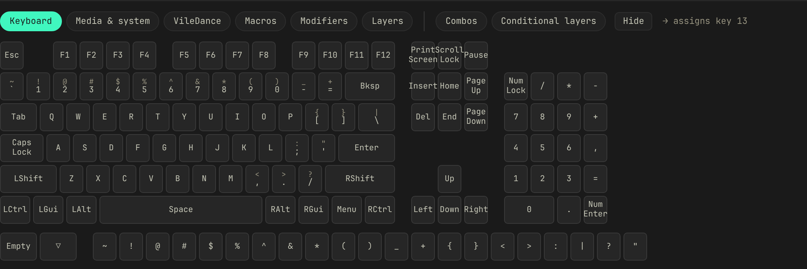
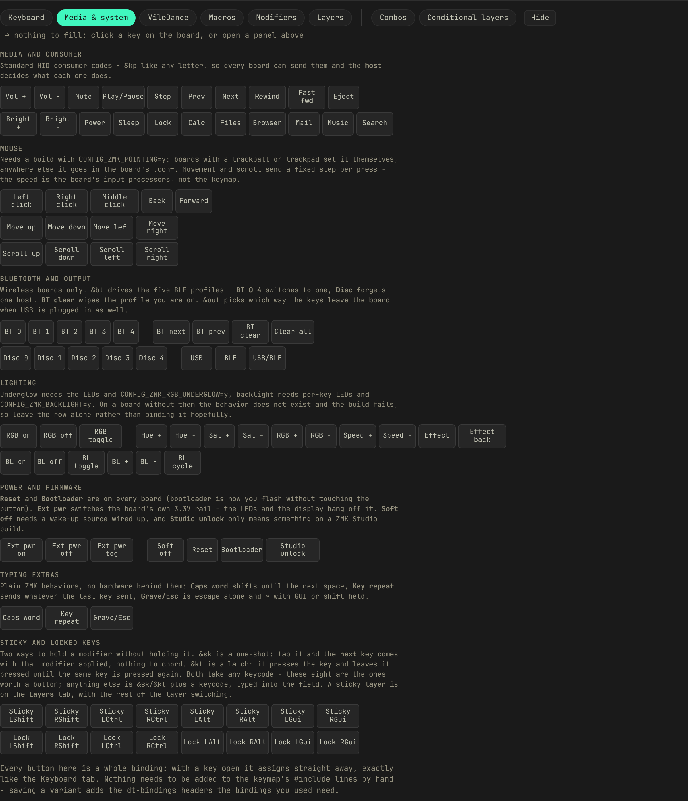
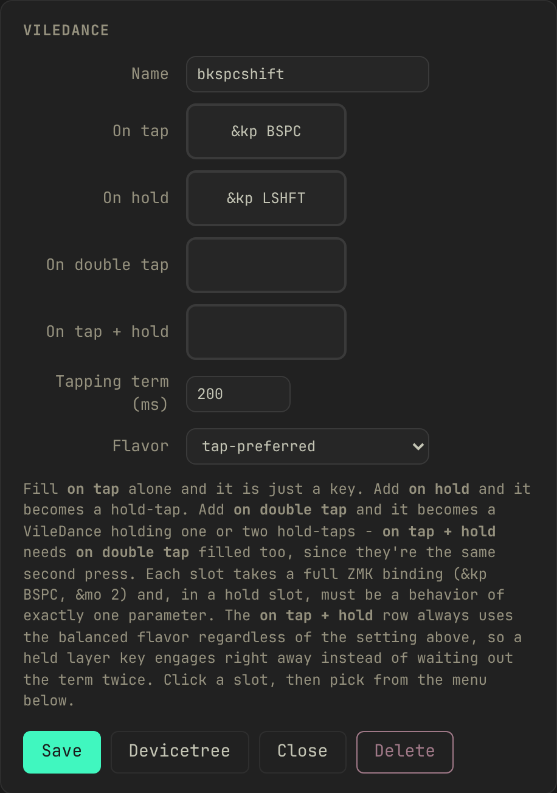
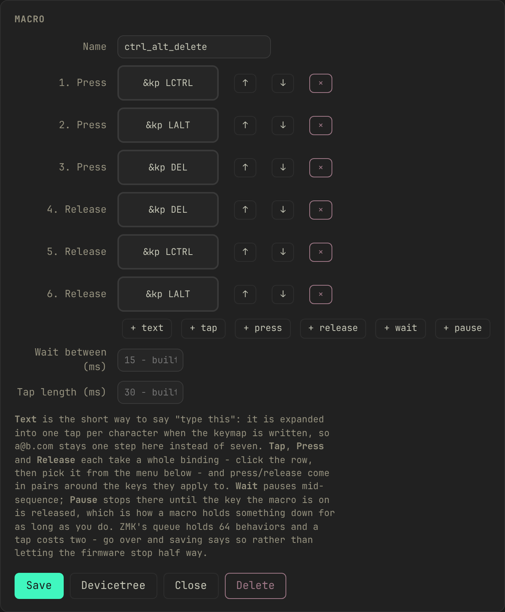
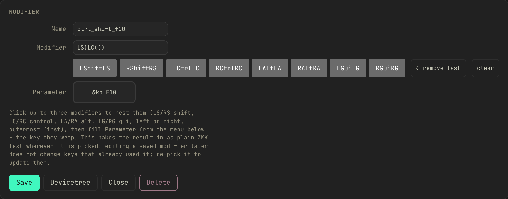
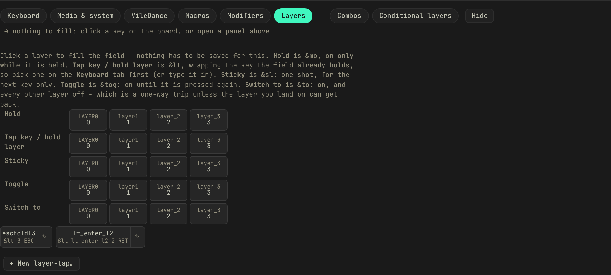
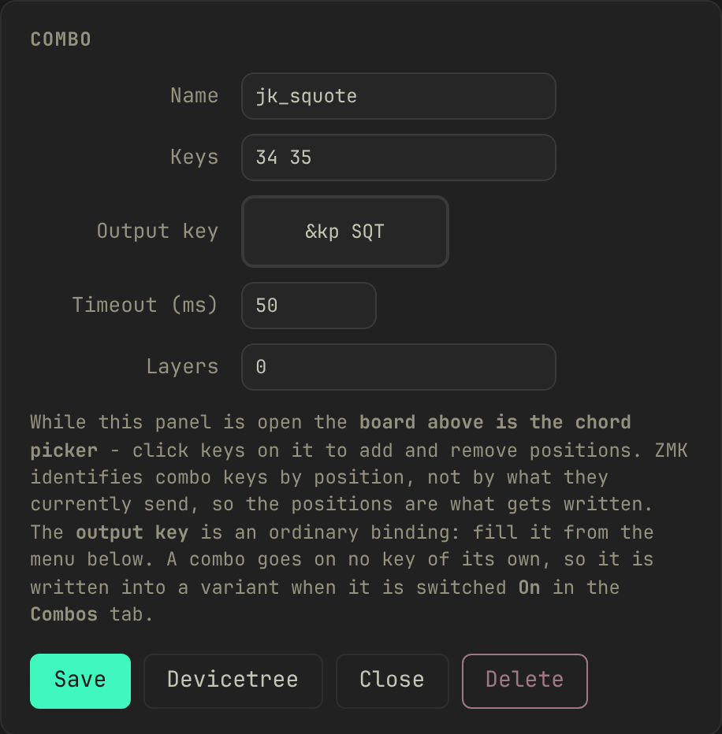
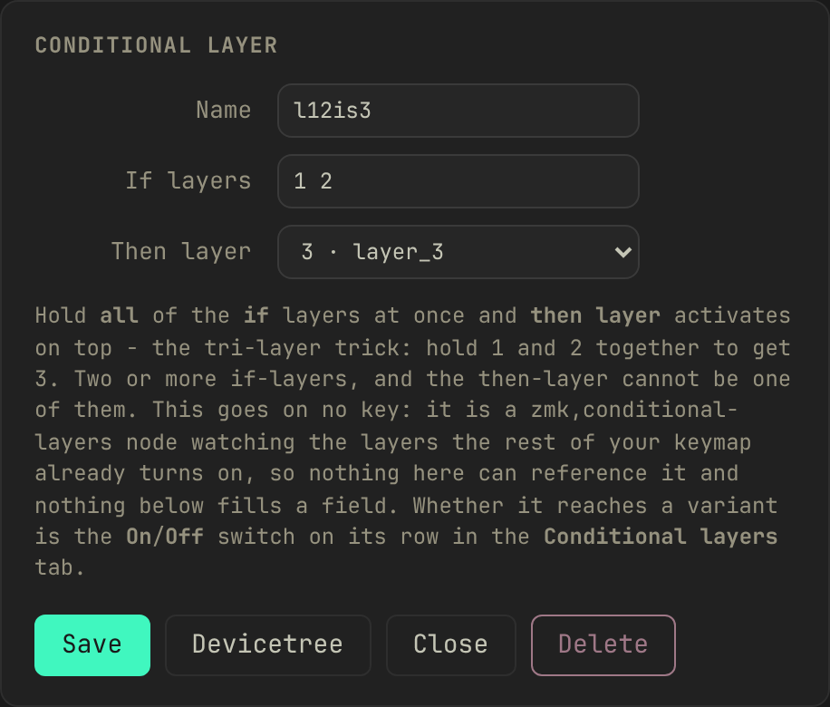

# The keymap tabs

[← back to the README](README.md#designing-a-keymap-every-tab-in-the-app)

What each of the eight tabs under the board does and what its settings mean.
How the tabs, key editor and creation panels work together is in the
[README](README.md#designing-a-keymap-every-tab-in-the-app).

- [Keyboard](#keyboard)
- [Media & system](#media--system)
- [VileDance: Vial-style tap dances](#viledance-vial-style-tap-dances)
- [Macros](#macros)
- [Modifiers](#modifiers)
- [Layers](#layers)
- [Combos and Conditional layers](#combos-and-conditional-layers)

## Keyboard

The plain 104-key ANSI layout. Click a key on the board to open its editor,
then click a key on this tab: that assigns the keycode straight away, with no
separate confirm step. Typing a binding by hand into the key editor's own field
still needs **Apply**.

## Media & system

Everything ZMK can send that a keyboard has no keycap for, in seven groups:

| group | examples | what the board needs |
|---|---|---|
| Media and consumer | volume, play/pause, brightness | nothing; every board sends these |
| Mouse | left/right/middle click, pointer movement, scroll | `CONFIG_ZMK_POINTING` |
| Bluetooth and output | profile select, clear, USB/BLE output | a wireless board |
| Lighting | underglow and backlight on/off, brightness, effect | the LEDs, plus the matching Kconfig |
| Power and firmware | soft off, bootloader, reset, Studio unlock | reset and bootloader are universal; the rest are not |
| Typing extras | caps word, key repeat, grave escape | nothing |
| Sticky and locked keys | one-shot (`&sk`) and latched (`&kt`) over the eight modifiers | nothing |

Each group names what has to be true of the board before its buttons do
anything. A binding whose feature the firmware was never built with fails to
compile rather than misbehaving. Saving a variant adds whatever `#include`
lines those bindings need and says so in the save message; you never add them
by hand.

This tab saves nothing. It is a picker, like Keyboard.

## VileDance: Vial-style tap dances

Vial has a **TapDance** key: one key position, up to four outputs depending on
how you hit it (a tap, a hold, a double tap, or a double tap where the second
press is held). ZMK has nothing that does all four in one behavior; getting a
hold *and* a double-tap out of a single key means nesting a hold-tap inside a
tap-dance. A **VileDance** is that composition, built for you from four
fields:

| slot | fires on |
|---|---|
| on tap | a single press and release |
| on hold | pressing and holding past the tapping term |
| on double tap | two presses within the tapping term |
| on tap + hold | the second press held down |

Fill only **on tap** and you get a plain key, with no extra devicetree. Add
**on hold** and it becomes one hold-tap behavior. Add **on double tap** (and
optionally **on tap + hold**) and it becomes a tap-dance holding one or two
hold-taps. A hold slot has to be a behavior that takes exactly one parameter
(`&kp`, `&mo`, `&sk`).

Two settings shape the timing. **Tapping term** sets how long a hold has to
last and how much time a second tap has to land in. **Flavor** decides how the
hold-tap resolves an interrupting keystroke. The tap/hold pair keeps whatever
flavor you set; the double-tap/tap-hold pair always resolves `balanced`,
because by the second press you have already committed to something other than
plain typing, and a layer-hold there should engage the instant the next key
lands. When tuning, note that a tap-dance's own term runs before the nested
hold-tap's, so a plain hold on this key lands at roughly *twice* the tapping
term you set.

A VileDance can't hold another VileDance in one of its four slots (a tap-dance
inside a tap-dance has timing nobody could predict), but it can hold a
**macro** in the double-tap or tap-hold slot. "Double tap to type my email" is
what that slot is for.

A saved VileDance is a live reference: bind it to as many keys as you like, and
editing the record later changes every one of them the next time you save a
variant. The board tile for a key bound to one shows the resolved tap with a
small hint for the hold in the corner, rather than the raw generated label.

## Macros

A **macro** is a sequence played back from one key, built from six kinds of
step:

| step | does |
|---|---|
| text | types the string you enter: one field for `someone@example.com` instead of nineteen key steps |
| tap | presses and releases one binding |
| press | holds a binding down across the steps that follow |
| release | lets a held binding go |
| wait | pauses for a number of milliseconds |
| pause | stops until the key the macro is bound to is itself released |

Add steps with the buttons under the list, reorder with the ↑/↓ next to each
row, remove one with ×. A text step only understands what a keyboard can
actually type (letters, digits, the shifted symbols, space, tab, newline).
Anything else, such as accented letters or emoji, is refused rather than
silently dropped, since there is no key position for it to send. One macro can
also only queue so much at once, capped by ZMK's own
`CONFIG_ZMK_BEHAVIORS_QUEUE_SIZE` (64 by default). A macro over that limit is
refused at save time rather than failing partway through on the keyboard.

A macro can't hold itself as one of its own steps, but it can hold another
saved macro, and can be the target of a VileDance slot or a combo's output.

## Modifiers

A chain of up to three [ZMK modifier
functions](https://zmk.dev/docs/keymaps/modifiers), shift, control, alt or gui,
each left or right, wrapped around a keycode. For example ctrl+shift+F10. Click
up to three of the eight modifier buttons in the panel (**remove last** and
**clear** walk them back), then use the menu below to fill **Parameter** with
the key they wrap: a plain key, or another saved modifier nested inside this
one's innermost slot.

Unlike a VileDance, a modifier's resolved text is baked in wherever you pick
it. There is no reference back to the saved record, because a modifier chain is
ZMK preprocessor syntax rather than a devicetree behavior. Editing a saved
modifier later leaves a key that already picked it alone; re-pick it to
propagate the change.

## Layers

Layer switching in all five of ZMK's shapes, as one-click rows at the top of
the tab. Four of them need no saving, since a layer number is the whole story:

| row | behavior | what it does |
|---|---|---|
| Hold | `&mo` | layer on while held, off on release |
| Tap key / hold layer | `&lt` | tap for a key, hold for the layer |
| Sticky | `&sl` | one shot, on for the next key press only |
| Toggle | `&tog` | on until the same key is pressed again |
| Switch to | `&to` | switches to this layer and turns every other one off |

**Tap key / hold layer** is the one row worth naming and saving. Give it a
tapping term or a flavor and it becomes its own generated hold-tap, with the
same live-reference behavior a VileDance has: a saved card you can bind to
several keys and edit in one place. Leave both blank and it builds the same
plain `&lt` the ad-hoc row gives you.

## Combos and Conditional layers

The two board-wide tabs. A **combo** fires a binding when two or more keys on
the board are pressed together. Open its panel and click the keys on the board
above to build the chord; there is no separate picker. A **conditional layer**
turns a layer on automatically while two or more other layers are held
together. The common case is hold layer 1 and layer 2, get layer 3.

Neither goes on a key, so neither can be picked into a field. What you decide
instead is whether *this keymap* gets it. Each row has an On/Off switch, per
keymap, so the same combo can be on for one variant and off for another. A
newly created one is switched on only for the keymap you designed it against;
flip it on for others yourself.

 

[← back to the README](README.md#designing-a-keymap-every-tab-in-the-app)
