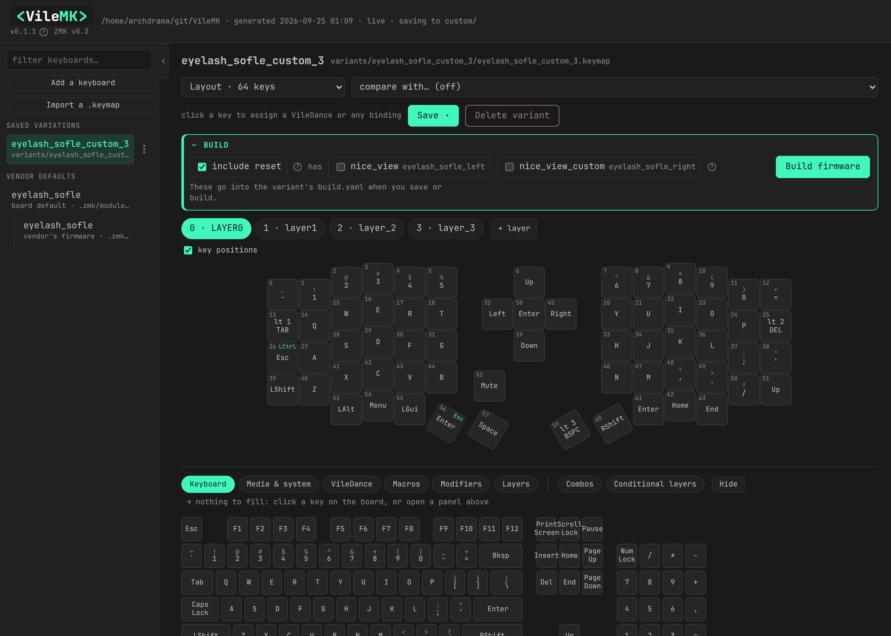
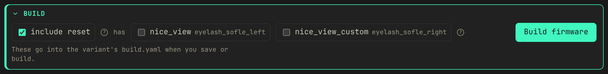
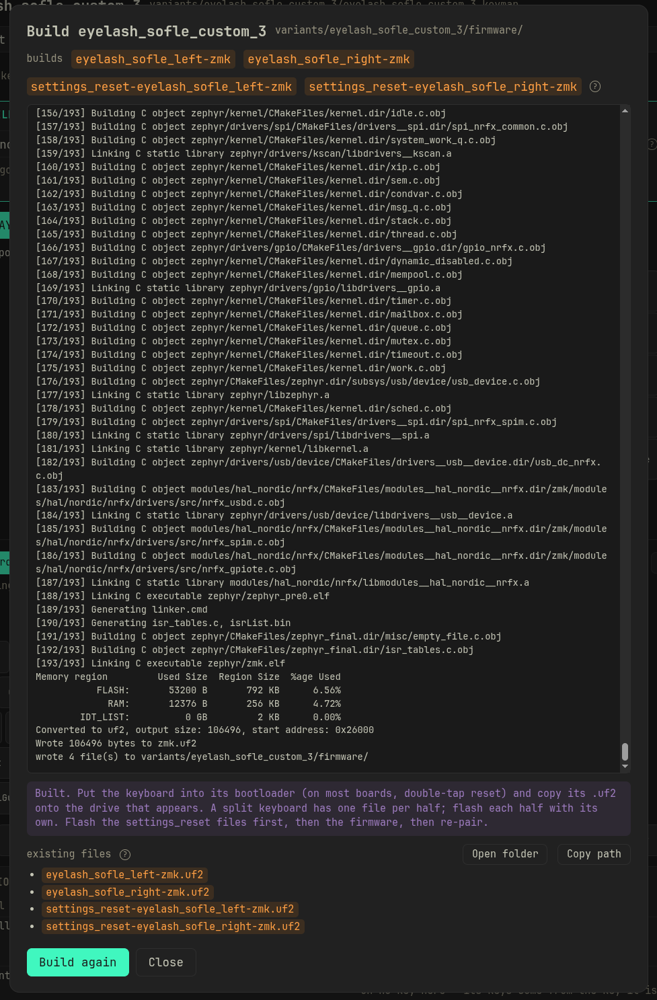

<p align="center">
  
</p>


VileMK builds ZMK firmware for your keyboard on your own machine, from a keymap
you edit in a local web app. The keymap can use the things ZMK Studio can't
express: combos, macros, VileDances (Vial-style tap/hold/double-tap dances),
hold-taps and home-row mods, mod-morphs, conditional layers. The build runs in
ZMK's own build container under Docker and produces the `.uf2` files you
flash.

The name is a nod to [Vial](https://get.vial.today/), the graphical keymap
editor from the QMK world that inspired this project. Vial is a potion bottle;
VileMK is vile, as in ruthless. There is no live USB protocol. You edit the
keymap in the app, it is validated locally, and the firmware is compiled
locally.



## Build your own firmware

From a fresh clone to a flashed keyboard. Each step is covered in more detail
further down.

### 1. Requirements

- **Python 3.9+.** The Python side has no dependencies.
- **Node**, to build the web app. `make design` does it for you.
- **Docker**, for the build itself. Your user has to be able to run `docker`
  without sudo (on Linux, be in the `docker` group). Without Docker the app
  still designs, checks and exports keymaps; the **Build firmware** button is
  off and says why.

### 2. Fetch ZMK

```bash
make zmk
```

That downloads the parts of ZMK the app needs and pins the exact commit, so
every keyboard and every variant is checked and built against the same ZMK. The
**ZMK** link under the logo in the app opens the same thing as a settings
sheet, with an **Update** button.

### 3. Start the app

```bash
make design
```

It builds the web app, then serves it on `http://127.0.0.1:7879`.

### 4. Add your keyboard

**Add a keyboard** in the sidebar lists every keyboard in ZMK and in the
keyboard modules you have installed. If yours comes from a vendor module that
is not installed yet, paste the module's GitHub URL and a branch or tag into
the same dialog; its keyboards then appear in the list. Adding a keyboard puts
its vendor keymap under **Vendor defaults** in the sidebar. For a keyboard that
plugs into a separate controller, you pick the controller.

### 5. Make a variant

Select the vendor default, change what you want on the board, and press
**Save as…**. It asks for a name and adds the keymap to **Saved variations**.
From then on you edit the variant, and its **Save** button offers **Overwrite**
or **Save as…**.

Vendor defaults are never edited. They are the starting point and the thing
**compare with…** compares against.

### 6. Build



The **Build** panel under the Save button holds the build options for the
variant on screen:

- **include reset** also builds a settings reset file for each half. See the
  warning under step 7 for when you need it.
- **has** lists the parts the vendor builds for (screens, add-on modules), per
  half. Tick the ones physically on your keyboard. An unticked screen also
  switches the display off for that half, so the build does not fail looking
  for hardware that is not there.

**Build firmware** uses those choices even if you haven't saved, and the
variant remembers them. The build log streams into the dialog, and the build
can be cancelled.

The first build pulls ZMK's build image (about 3 GB) and fetches ZMK, Zephyr
and the hardware libraries. That takes several minutes. A later build of a
split keyboard takes about 20 seconds.



When it finishes, the dialog lists the files it wrote. **Open folder** opens
the firmware folder in your file manager and **Copy path** copies its location.
Before a build, the same list shows what is already there: files the next
build replaces are in orange, files it will remove are struck out.

The same build from a terminal:

```bash
make firmware ARGS=<variant>
```

### 7. Flash

Put the keyboard into its bootloader (on most boards, double-tap reset and it
mounts as a USB drive) and copy its `.uf2` across. A split keyboard has one
file per half, for example `eyelash_sofle_left-zmk.uf2` and
`eyelash_sofle_right-zmk.uf2`, and each half is flashed with its own. A board
that produces a `.bin` instead has no drive to copy to; flash it with the
board's own tool.

> [!WARNING]
> **If the keyboard has ever been used with ZMK Studio**, flash the settings
> reset first. ZMK Studio saves the keys you change in it to the keyboard's
> settings storage, and on every boot those saved keys override the keymap in
> the firmware, for those positions only. Flashing new firmware does not clear
> them and neither does the reset button. The symptom is a keyboard that runs
> your new keymap except for a few keys that do something else or nothing.
> It happens with any ZMK firmware, however it was built.
>
> Tick **include reset** before building. Flash the two `settings_reset-…`
> files to their halves, then the firmware, then pair Bluetooth again: the
> reset clears the Bluetooth pairings too.

## The keyboard list

The sidebar has two groups.

**Saved variations** are your keymaps. They are the only ones you can
overwrite and build.

**Vendor defaults** are the keymaps that come with a keyboard. They are for
comparing against (**compare with…**) and for starting a new variation.

Some vendors ship two keymaps for one keyboard, so the keyboard is listed
twice, each marked:

- **board default** is the keymap ZMK falls back to when a build names none.
- **vendor's firmware** is the keymap the vendor's released firmware is built
  from. It can differ from the board default. The Eyelash Sofle's has a fourth
  layer, left empty as a spare. It is listed one step in, under the board
  default.

The **⋮** button beside each row has **Export keymap**, **Export as picture**,
and **Delete**. Delete on a variation deletes it and its built firmware. On a
vendor default it removes the keyboard from the project, and the keyboard's
module with it. That is refused while variations use the keyboard, and the
dialog names them; delete those first.

### Keyboard modules

**Add a keyboard** also lists your modules. **Update** fetches the latest
commit of the module's branch or tag and checks your variations against it
before replacing anything. If one would break (a key removed from the layout, a
board renamed), the module is left as it was and the dialog lists what would
break, with **Overwrite** to install it anyway. **Remove** is refused while a
variation still uses one of the module's keyboards. **Rename** changes only the
name the app shows.

From the command line:

```bash
make module ARGS="add <github-url> --ref main"
```

```bash
make module ARGS=<name>
```

## Designing a keymap: every tab in the app

Under the board is a menu of eight tabs: **Keyboard**, **Media & system**,
**VileDance**, **Macros**, **Modifiers**, **Layers**, **Combos** and
**Conditional layers**.

Click a key on the board to open its editor. Whichever tab you're on, picking
something fills that key. The tabs' **+ New …** buttons open a creation panel
above the menu instead, and the menu then fills whichever field in that panel
you last clicked. Only one thing is ever open at once, a key editor or a panel,
but switching loses nothing you typed: each kind keeps its own unsaved draft,
and the tab you left grows a **Resume …** button until you finish it or start a
fresh one.

Six of the eight tabs fill a field this way. **Combos** and **Conditional
layers** don't, because nothing on the board can point at either one. You
switch those on or off for the keymap you're looking at. Both are covered
below.

The **key positions** checkbox under the layer tabs numbers every key on the
board. **+ layer** beside the layer tabs adds a layer, up to ZMK's own 32-layer
cap. It asks for a name and starts the layer blank (every key transparent);
nothing is written until you save.

Rotary encoders are not editable in the app yet. Saving a variant keeps the
encoder bindings the keymap already had, and `make check` still validates them.
To change one, edit the keymap file by hand.

### Keyboard

The plain 104-key ANSI layout. Click a key on the board to open its editor,
then click a key on this tab: that assigns the keycode straight away, with no
separate confirm step. Typing a binding by hand into the key editor's own field
still needs **Apply**.


### Media & system

Everything ZMK can send that a keyboard has no keycap for, in seven groups:

| group | examples | what the board needs |
|---|---|---|
| Media and consumer | volume, play/pause, brightness | nothing; every board sends these |
| Mouse | left/right/middle click, pointer movement, scroll | `CONFIG_ZMK_POINTING` |
| Bluetooth and output | profile select, clear, USB/BLE output | a wireless board |
| Lighting | underglow and backlight on/off, brightness, effect | the LEDs, plus the matching Kconfig |
| Power and firmware | soft off, bootloader, reset, Studio unlock | reset and bootloader are universal; the rest are not |
| Typing extras | caps word, key repeat, grave escape | nothing |
| Sticky and locked keys | one-shot (`&sk`) and latched (`&kt`) over the eight modifiers | nothing |

Each group names what has to be true of the board before its buttons do
anything. A binding whose feature the firmware was never built with fails to
compile rather than misbehaving. Saving a variant adds whatever `#include`
lines those bindings need and says so in the save message; you never add them
by hand.

This tab saves nothing. It is a picker, like Keyboard.


### VileDance: Vial-style tap dances

Vial has a **TapDance** key: one key position, up to four outputs depending on
how you hit it (a tap, a hold, a double tap, or a double tap where the second
press is held). ZMK has nothing that does all four in one behavior; getting a
hold *and* a double-tap out of a single key means nesting a hold-tap inside a
tap-dance. A **VileDance** is that composition, built for you from four
fields:

| slot | fires on |
|---|---|
| on tap | a single press and release |
| on hold | pressing and holding past the tapping term |
| on double tap | two presses within the tapping term |
| on tap + hold | the second press held down |

Fill only **on tap** and you get a plain key, with no extra devicetree. Add
**on hold** and it becomes one hold-tap behavior. Add **on double tap** (and
optionally **on tap + hold**) and it becomes a tap-dance holding one or two
hold-taps. A hold slot has to be a behavior that takes exactly one parameter
(`&kp`, `&mo`, `&sk`).

Two settings shape the timing. **Tapping term** sets how long a hold has to
last and how much time a second tap has to land in. **Flavor** decides how the
hold-tap resolves an interrupting keystroke. The tap/hold pair keeps whatever
flavor you set; the double-tap/tap-hold pair always resolves `balanced`,
because by the second press you have already committed to something other than
plain typing, and a layer-hold there should engage the instant the next key
lands. When tuning, note that a tap-dance's own term runs before the nested
hold-tap's, so a plain hold on this key lands at roughly *twice* the tapping
term you set.

A VileDance can't hold another VileDance in one of its four slots (a tap-dance
inside a tap-dance has timing nobody could predict), but it can hold a
**macro** in the double-tap or tap-hold slot. "Double tap to type my email" is
what that slot is for.

A saved VileDance is a live reference: bind it to as many keys as you like, and
editing the record later changes every one of them the next time you save a
variant. The board tile for a key bound to one shows the resolved tap with a
small hint for the hold in the corner, rather than the raw generated label.


### Macros

A **macro** is a sequence played back from one key, built from six kinds of
step:

| step | does |
|---|---|
| text | types the string you enter: one field for `someone@example.com` instead of nineteen key steps |
| tap | presses and releases one binding |
| press | holds a binding down across the steps that follow |
| release | lets a held binding go |
| wait | pauses for a number of milliseconds |
| pause | stops until the key the macro is bound to is itself released |

Add steps with the buttons under the list, reorder with the ↑/↓ next to each
row, remove one with ×. A text step only understands what a keyboard can
actually type (letters, digits, the shifted symbols, space, tab, newline).
Anything else, such as accented letters or emoji, is refused rather than
silently dropped, since there is no key position for it to send. One macro can
also only queue so much at once, capped by ZMK's own
`CONFIG_ZMK_BEHAVIORS_QUEUE_SIZE` (64 by default). A macro over that limit is
refused at save time rather than failing partway through on the keyboard.

A macro can't hold itself as one of its own steps, but it can hold another
saved macro, and can be the target of a VileDance slot or a combo's output.


### Modifiers

A chain of up to three [ZMK modifier
functions](https://zmk.dev/docs/keymaps/modifiers), shift, control, alt or gui,
each left or right, wrapped around a keycode. For example ctrl+shift+F10. Click
up to three of the eight modifier buttons in the panel (**remove last** and
**clear** walk them back), then use the menu below to fill **Parameter** with
the key they wrap: a plain key, or another saved modifier nested inside this
one's innermost slot.

Unlike a VileDance, a modifier's resolved text is baked in wherever you pick
it. There is no reference back to the saved record, because a modifier chain is
ZMK preprocessor syntax rather than a devicetree behavior. Editing a saved
modifier later leaves a key that already picked it alone; re-pick it to
propagate the change.


### Layers

Layer switching in all five of ZMK's shapes, as one-click rows at the top of
the tab. Four of them need no saving, since a layer number is the whole story:

| row | behavior | what it does |
|---|---|---|
| Hold | `&mo` | layer on while held, off on release |
| Tap key / hold layer | `&lt` | tap for a key, hold for the layer |
| Sticky | `&sl` | one shot, on for the next key press only |
| Toggle | `&tog` | on until the same key is pressed again |
| Switch to | `&to` | switches to this layer and turns every other one off |

**Tap key / hold layer** is the one row worth naming and saving. Give it a
tapping term or a flavor and it becomes its own generated hold-tap, with the
same live-reference behavior a VileDance has: a saved card you can bind to
several keys and edit in one place. Leave both blank and it builds the same
plain `&lt` the ad-hoc row gives you.


### Combos and Conditional layers

The two board-wide tabs. A **combo** fires a binding when two or more keys on
the board are pressed together. Open its panel and click the keys on the board
above to build the chord; there is no separate picker. A **conditional layer**
turns a layer on automatically while two or more other layers are held
together. The common case is hold layer 1 and layer 2, get layer 3.

Neither goes on a key, so neither can be picked into a field. What you decide
instead is whether *this keymap* gets it. Each row has an On/Off switch, per
keymap, so the same combo can be on for one variant and off for another. A
newly created one is switched on only for the keymap you designed it against;
flip it on for others yourself.

 

### Saving

Every design above is saved as you work, independent of any keymap. Nothing
reaches a keymap until you save a variant. Only the generated behaviors your
keys, VileDances and combos actually reference are written into it; anything
designed but never bound stays out.

## Sharing a layout

Sharing means sharing the `.keymap`. **Export keymap** in a row's **⋮** menu
works for variations and vendor defaults. It offers **Save as…** (pick where to
write the file) or **Copy to clipboard**, and **include key positions** adds a
comment at the top of the file drawing the layout with each key's position
number. The exported file carries one extra comment line listing the
VileDances, macros, combos and layer entries the keymap uses, which is what
lets VileMK restore them on import. The compiler ignores it.

**Import a .keymap** in the sidebar takes one back, or you can drop the file on
the sidebar. It refuses a keymap for a keyboard you have not added, since
without the physical layout there is nothing to draw, and tells you which
module to add. Where an incoming record has the same name as one of yours but
different contents, it asks: rename the incoming one (every reference in the
keymap is rewritten to match) or keep yours. Your own records are never
overwritten. What it writes is a new variant, and it runs the same checks
`make check` does before handing it back.

**Export as picture**, in the same menu, has **Copy image**, **Save PNG** and
**Save SVG**, for pasting a layout into a chat.

## Building firmware in detail

**Build firmware** compiles every half of the variant, plus the settings reset
files if **include reset** is ticked. The firmware folder is replaced only when
everything built; a failed or cancelled build leaves the previous files. A
variant whose keyboard is not installed (its module was removed, or the keymap
came from someone else) is refused before Docker starts, with a message naming
the missing board.

The build runs in `zmkfirmware/zmk-build-arm:stable`, the image ZMK's own build
workflow uses. The ZMK and Zephyr sources it fetches on the first build are
kept in a Docker volume, `vilemk-zmk`, and reused by later builds. To free the
space:

```bash
docker volume rm vilemk-zmk
```

The next build fetches them again.

### Parts the vendor lists

Most keyboards are more than a board. A screen, an encoder or an add-on module
is a separate part the build has to be told about, on the half it is plugged
into. The vendor writes one build list for every version they sell, with a
screen and without, so it cannot say which one is on your desk. That is what
the Build panel's **has** boxes are for.

An unticked screen switches the display off for that half, because a vendor
building for the version with a screen often turns the display on for
everyone, and the build then fails looking for hardware that is not there. To
switch a feature off for a half yourself, put the setting in that half's
`.conf` file in `config/`, named after the board (for an Eyelash Sofle's left
half, `config/eyelash_sofle_left.conf`):

```
CONFIG_ZMK_DISPLAY=n
```

It is added on top of the vendor's settings, and nothing VileMK fetches ever
overwrites it.

`make check` compares a variant's build against the vendor's list and prints
what is missing, such as a part the vendor builds that your variant leaves out
with nothing switching the matching feature off. It never changes anything. It
cannot catch a part the vendor never listed, or a keyboard with no vendor
module at all, and says so when it has nothing to compare against.

### A worked example: Eyelash Sofle

The Eyelash Sofle comes from the `zmk-eyelash-sofle` module, and after adding
it the sidebar shows its keymaps under **Vendor defaults**. In the app you
design some VileDances and combos, bind them, and **Save as…**
`eyelash_sofle_colemak`.

The vendor lists `nice_view` on the left half and `nice_view_custom` on the
right, so the Build panel shows both under **has**. This keyboard has no
screens, so both stay unticked, and the left half gets its display switched
off.

**Build firmware** then writes `eyelash_sofle_left-zmk.uf2` and
`eyelash_sofle_right-zmk.uf2`. Flash the left half with the left file and the
right half with the right one. If the keyboard has been used with ZMK Studio,
read the warning under [step 7](#7-flash) first.

## make

```
make          # check every keymap, then build the app and serve it
make design   # build the app, then serve it
make check    # validate every keymap and build list
make pos      # print each keyboard's key-position map
make zmk      # fetch ZMK and pin the commit
make module ARGS=<name>        # fetch or update a keyboard module
make firmware ARGS=<variant>   # build a variant's firmware (needs Docker)
make install  # put the vilemk-* commands on your PATH
```

If the page ever says the app is not built yet, run `make web`.

`make` only looks for a Makefile in the current directory. From anywhere else,
point it at the checkout:

```bash
make -C path/to/VileMK
```

Or run `make install` once and use the `vilemk-*` commands (`vilemk-design`,
`vilemk-check`, `vilemk-build` and the rest) from any directory.
