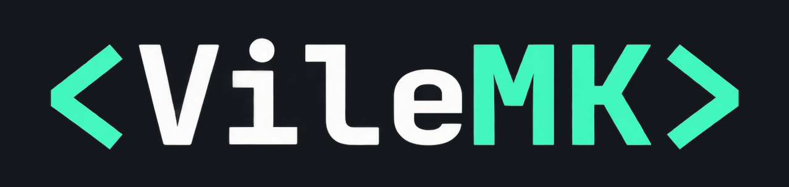
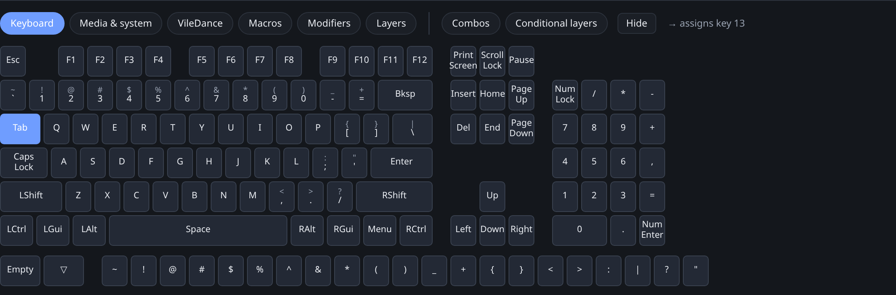
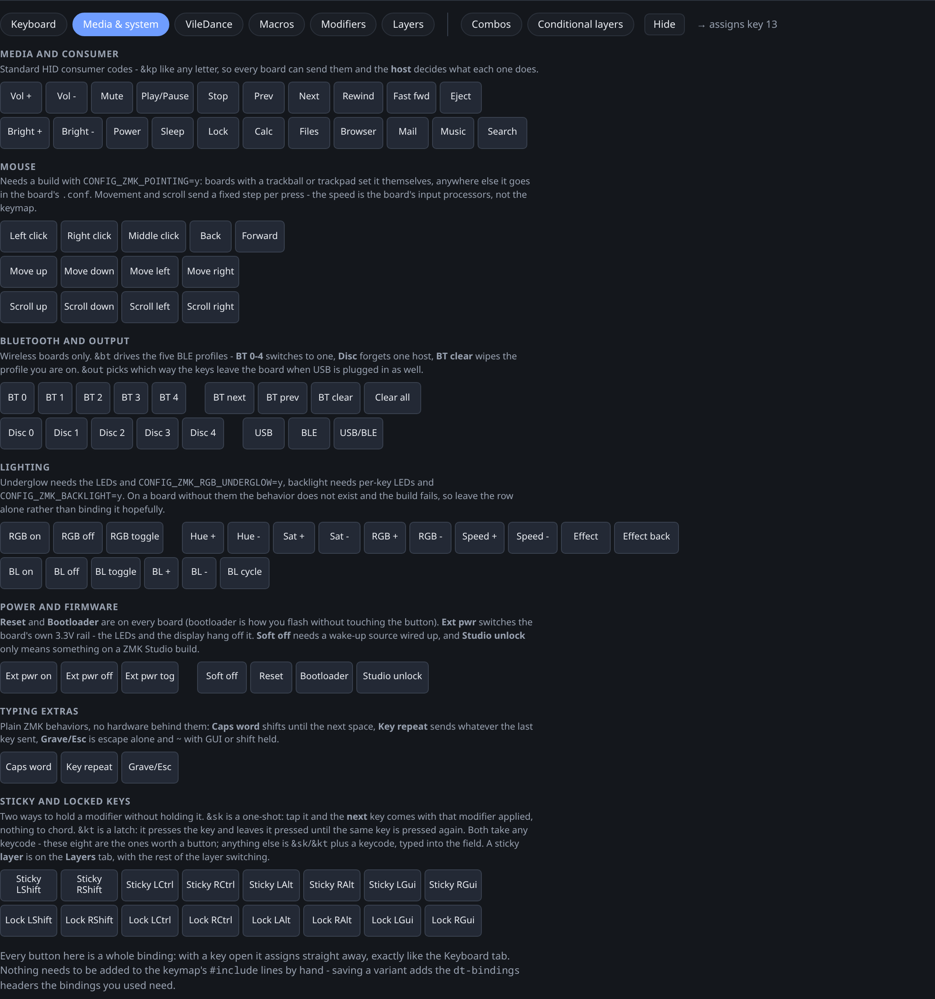
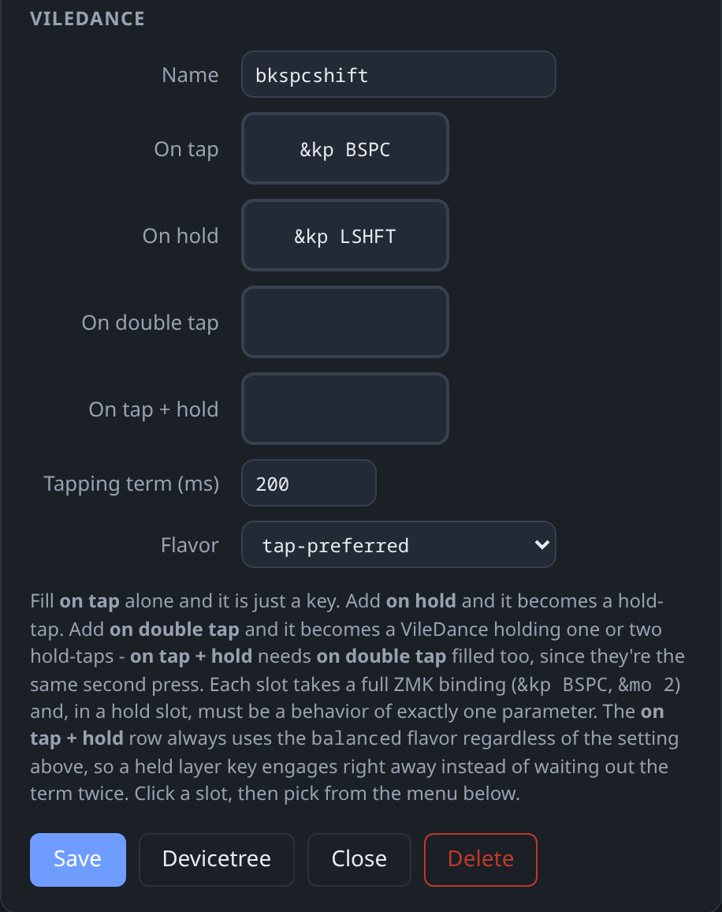
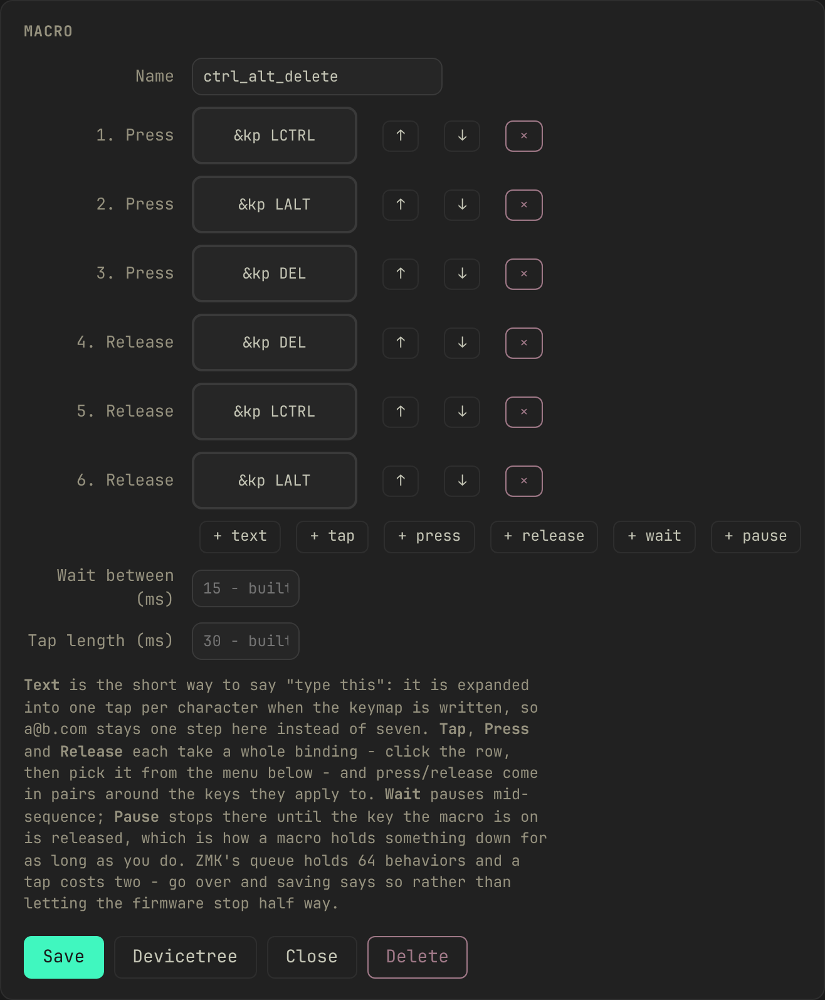
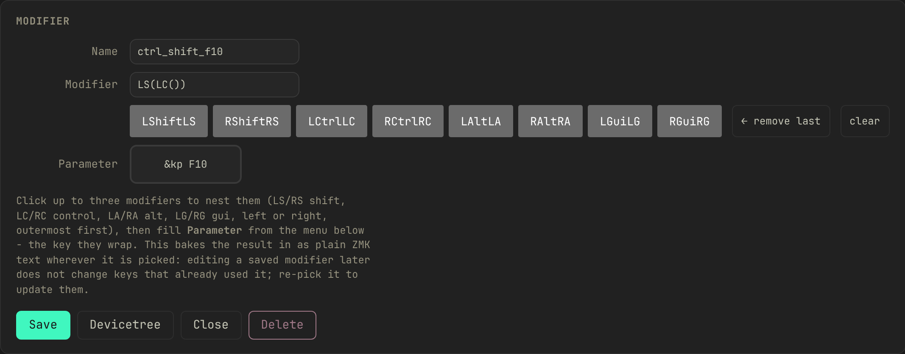
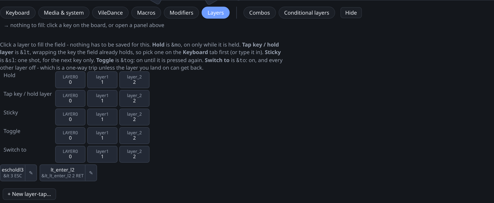
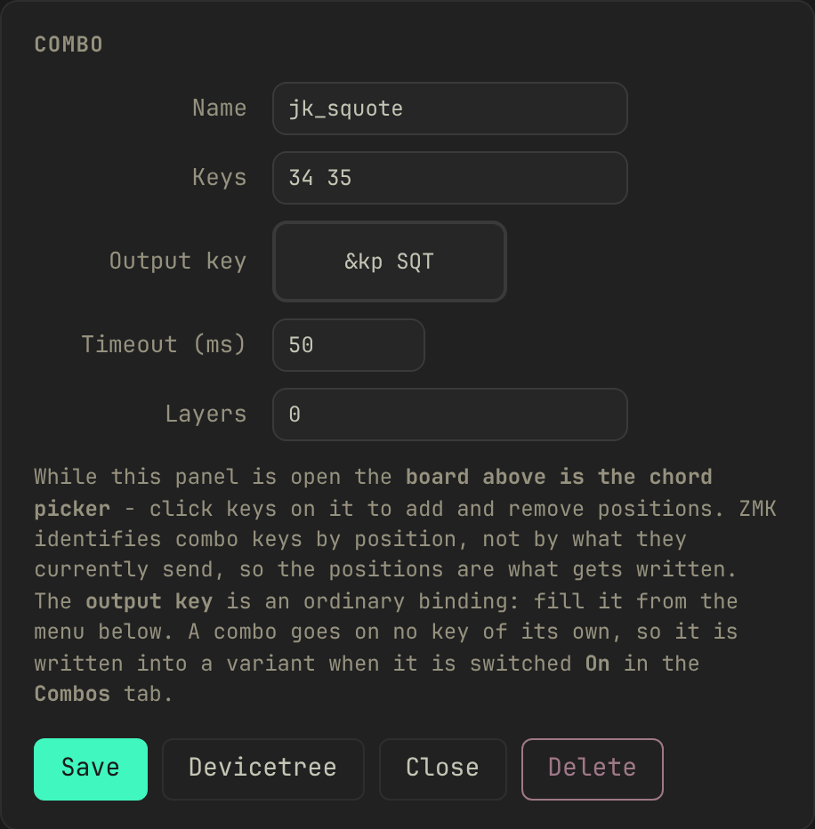
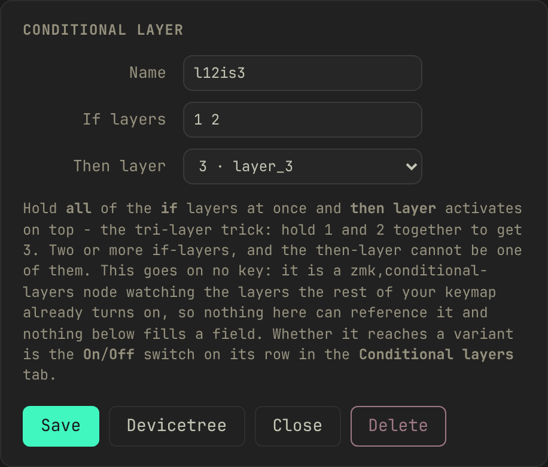

<p align="center">
  
</p>

<p align="center">
  <a href="https://www.youtube.com/watch?v=jn9MJbdGJI8">
    <br>
    
  </a>
</p>

Tooling for authoring ZMK keymaps by hand, covering the things ZMK Studio
can't express: combos, macros, VileDances (Vial-style tap/hold/double-tap
dances), hold-taps and home-row mods, mod-morphs, conditional layers.

Rotary encoders are the exception. Their bindings are validated and
documented, but not yet editable in the app; see
[Designing a keymap](#designing-a-keymap-every-tab-in-the-app) below.

The name is a nod to [Vial](https://get.vial.today/), the graphical keymap
editor from the QMK world that inspired this project. Vial is a potion bottle;
VileMK is vile, as in ruthless. There is no live USB protocol. You write
devicetree, validate it locally, and build the firmware locally in ZMK's
build container.

## Where things live

Everything is in this checkout. Only the code is committed; the rest is
yours and gitignored:

| path | what it is |
|---|---|
| `config/` | `west.yml` (which ZMK and which keyboard modules) and each keyboard's `.conf` settings |
| `build.yaml` | the board and shield combinations your keyboards build |
| `.zmk/` | board data fetched from ZMK and from keyboard modules |
| `custom/` | the VileDances, macros, combos, modifiers and layers you design |
| `variants/` | saved keymaps, each with the `build.yaml` that builds it |

ZMK's board data comes from GitHub. In a fresh checkout, fetch it once:

```bash
make zmk
```

That downloads the parts of ZMK the app reads into `.zmk/zmk/` and records
the exact commit in `config/west.yml`. The **ZMK** link under the logo opens
the same thing as a settings sheet, with an **Update** button. Leave the
repository and branch alone unless you know you need a different ZMK: every
keyboard and variant is checked and built against it.

**Add a keyboard** in the sidebar lists every keyboard in ZMK and in the
modules you have installed, and can fetch a keyboard module from GitHub.

Then run the server and modify the mappings:

```bash
make design
```

It loads your keyboards' keymaps, drawn on their real key positions. Click
keys to reassign them; design VileDances, macros, combos, modifiers and
layers on top. **Save as new variant** writes the modified keymap and a
matching `build.yaml` under `variants/`.

### The keyboard list

The sidebar has two groups.

**Saved variations** are your keymaps in `variants/`. They are the only ones
you can overwrite and build.

**Vendor defaults** are the keymaps that come with a keyboard, read from
`.zmk/`. They are for comparing against (**compare with…**) and for starting
a new variation. They are never edited: `.zmk/` holds exactly what the
vendor's repository has at the commit pinned in `config/west.yml`, and
fetching the module again gives the same files.

Some vendors ship two keymaps for one keyboard, so the keyboard is listed
twice, each marked:

- **board default** is the keymap ZMK falls back to when a build names none.
- **vendor's firmware** is the keymap in the vendor's own `config/`, the one
  their released firmware is built from. It can differ from the board
  default. The Eyelash Sofle's has a fourth layer, left empty as a spare.
  It is listed one step in, under the board default.

The gear beside each row has **Export as picture**, and **Delete** on a
variation or on a keyboard's board default. Deleting a keyboard removes its
`build.yaml` entries and, for a keyboard from a module, the module. It is
refused while variations use the keyboard, and the dialog names them; delete
those first.

Keymaps in `config/` are not listed. A variation's build names its own
keymap, so ZMK never compiles one from `config/`.

## Requirements

**Python 3.9+ and Node.** The Python side has no dependencies, but the keymap
UI is a React app in `web/` and has to be built once. Its output,
`vilemk/webui/dist/`, is generated rather than committed, so build it after
cloning and again whenever anything under `web/src/` changes:

```bash
make web
```

`make design` depends on that target, so the ordinary path stays one command.
Once `node_modules/` exists the build takes a few seconds. If you ever see a
page saying the app is not built yet, that is the command it is asking for.

**Docker, optionally**, for building firmware; see
[Building firmware](#building-firmware). Everything else works without it.

Optionally, `pyproject.toml` installs the tools as commands
(`vilemk-keypos`, `vilemk-check`, `vilemk-design`, `vilemk-workspace`,
`vilemk-build`), so they work from any directory:

```bash
uv tool install --editable .    # or: pip install -e .
```

## Tools

| Command | What it does |
|---|---|
| `python3 -m vilemk.keypos variants/<name>/<name>.keymap` | Prints the key-position map for a keyboard: the numbers `key-positions` and `hold-trigger-key-positions` refer to. |
| `python3 -m vilemk.check variants/<name>/<name>.keymap` | Static validation before a build: binding counts per layer, out-of-range positions, undefined `&labels`, bad keycodes, arity, braces. It also reads `build.yaml` and flags a `KEYMAP_FILE` left in it (the build adds one), a part the vendor builds that your entry leaves out, and colliding artifact names. Pass `--no-build-list` for keymaps only. |
| `python3 -m vilemk.firmware <variant>` | Builds a variant's firmware in Docker into `variants/<variant>/firmware/`. `--dry-run` prints the command and script without running them. |
| `python3 -m vilemk.webui.server` | The app: every keymap drawn on its real key positions, with layer tabs, combos and a compare view, plus the editor — design VileDances, macros, combos, modifiers and layer bindings in Vial-style panels, click keys to reassign them, save to `custom/` and `variants/`, and export or import a `.keymap`. |

### Designing a keymap: every tab in the app

```bash
make design
```

This opens the viewer at `http://127.0.0.1:7879` with one board on screen and
a menu of eight tabs underneath it: **Keyboard**, **Media & system**,
**VileDance**, **Macros**, **Modifiers**, **Layers**, **Combos** and
**Conditional layers**.

Click a key on the board to open its editor. Whichever tab you're on, picking
something fills that key. The tabs' **+ New …** buttons open a creation panel
above the menu instead, and the menu then fills whichever field in that panel
you last clicked. Only one thing is ever open at once, a key editor or a
panel, but switching loses nothing you typed: each kind keeps its own unsaved
draft, and the tab you left grows a **Resume …** button until you finish it
or start a fresh one.

Six of the eight tabs fill a field this way. **Combos** and **Conditional
layers** don't, because nothing on the board can point at either one. You
switch those on or off for the keymap you're looking at. Both are covered
below.

Rotary encoders are not editable in the app yet. A layer's `sensor-bindings`
is a separate property from its key `bindings`, and the knob has no key
position on the board to click, so the editor never sees it. Encoder bindings
are still checked by `make check`, which validates their keycodes, and saving a
variant carries the base keymap's `sensor-bindings` through as they are. To
change one, edit the keymap by hand; see the Encoder recipe in
[docs/recipes.md](docs/recipes.md). What it would take to build is written up
in [docs/todo.md](docs/todo.md).

#### Keyboard

The plain 104-key ANSI layout. Click a key on the board to open its editor,
then click a key on this tab: that assigns the keycode straight away, with no
separate confirm step. Typing a binding by hand into the key editor's own
field still needs **Apply**.



#### Media & system

Everything ZMK can send that a keyboard has no keycap for, in seven groups:

| group | examples | what the board needs |
|---|---|---|
| Media and consumer | volume, play/pause, brightness | nothing; every board sends these |
| Mouse | left/right/middle click, pointer movement, scroll | `CONFIG_ZMK_POINTING` |
| Bluetooth and output | profile select, clear, USB/BLE output | a wireless board |
| Lighting | underglow and backlight on/off, brightness, effect | the LEDs, plus the matching Kconfig |
| Power and firmware | soft off, bootloader, reset, Studio unlock | reset and bootloader are universal; the rest are not |
| Typing extras | caps word, key repeat, grave escape | nothing |
| Sticky and locked keys | one-shot (`&sk`) and latched (`&kt`) over the eight modifiers | nothing |

Each group names what has to be true of the board before its buttons do
anything. A binding whose feature the firmware was never built with fails to
compile rather than misbehaving. Saving a variant adds whatever `#include`
lines those bindings need and says so in the save message; you never add them
by hand.

This tab saves nothing. No record, no card, just a picker like Keyboard.



#### VileDance: Vial-style tap dances

Vial, the QMK-world editor this project takes its name from, has a
**TapDance** key: one key position, up to four outputs depending on how you
hit it (a tap, a hold, a double tap, or a double tap where the second press is
held). ZMK has nothing that does all four in one behavior; getting a hold
*and* a double-tap out of a single key means nesting a hold-tap inside a
tap-dance. A **VileDance** is that composition, built for you from four
fields:

| slot | fires on |
|---|---|
| on tap | a single press and release |
| on hold | pressing and holding past the tapping term |
| on double tap | two presses within the tapping term |
| on tap + hold | the second press held down |

Fill only **on tap** and you get a plain key, with no extra devicetree. Add
**on hold** and it becomes one hold-tap behavior. Add **on double tap** (and
optionally **on tap + hold**) and it becomes a tap-dance holding one or two
hold-taps. A hold slot has to be a behavior that takes exactly one parameter
(`&kp`, `&mo`, `&sk`), not one that takes none.

Two settings shape the timing. **Tapping term** sets how long a hold has to
last and how much time a second tap has to land in. **Flavor** decides how the
hold-tap resolves an interrupting keystroke. The tap/hold pair keeps whatever
flavor you set; the double-tap/tap-hold pair always resolves fast
(`balanced`), because by the second press you have already committed to
something other than plain typing, and a layer-hold there should engage the
instant the next key lands. When tuning, note that a tap-dance's own term runs
before the nested hold-tap's, so a plain hold on this key lands at roughly
*twice* the tapping term you set.

A VileDance can't hold another VileDance in one of its four slots (a tap-dance
inside a tap-dance has timing nobody could predict), but it can hold a
**macro** in the double-tap or tap-hold slot. "Double tap to type my email" is
what that slot is for.

A saved VileDance is a live reference: bind it to as many keys as you like,
and editing the record later changes every one of them the next time you save
a variant. The board tile for a key bound to one shows the resolved tap with a
small hint for the hold in the corner, rather than the raw generated label.



#### Macros

A **macro** is a sequence played back from one key, built from six kinds of
step:

| step | does |
|---|---|
| text | types the string you enter: one field for `someone@example.com` instead of nineteen key steps |
| tap | presses and releases one binding |
| press | holds a binding down across the steps that follow |
| release | lets a held binding go |
| wait | pauses for a number of milliseconds |
| pause | stops until the key the macro is bound to is itself released |

Add steps with the buttons at the bottom of the panel, reorder two with the
↑/↓ next to each row, remove one with ✕. A text step only understands what a
keyboard can actually type (letters, digits, the shifted symbols, space, tab,
newline). Anything else, such as accented letters or emoji, is refused rather
than silently dropped, since there is no key position for it to send. One
macro can also only queue so much at once, capped by ZMK's own
`CONFIG_ZMK_BEHAVIORS_QUEUE_SIZE` (64 by default). A macro over that limit is
refused at save time rather than failing partway through on the keyboard.

A macro can't hold itself as one of its own steps, but it can hold another
saved macro, and can be the target of a VileDance slot or a combo's output.



#### Modifiers

A chain of up to three [ZMK modifier
functions](https://zmk.dev/docs/keymaps/modifiers), shift, control, alt or
gui, each left or right, wrapped around a keycode. For example ctrl+shift+A.
Click up to three of the eight modifier buttons in the panel (**remove last**
and **clear** walk them back), then use the menu below to fill **Parameter**
with the key they wrap: a plain key, or another saved modifier nested inside
this one's innermost slot.

Unlike a VileDance, a modifier's resolved text is baked in wherever you pick
it. There is no reference back to the saved record, because a modifier chain
is ZMK preprocessor syntax rather than a devicetree behavior. Editing a saved
modifier later leaves a key that already picked it alone; re-pick it to
propagate the change.



#### Layers

Layer switching in all five of ZMK's shapes, as one-click rows at the top of
the tab. Four of them need no saving, since a layer number is the whole story:

| row | behavior | what it does |
|---|---|---|
| Hold | `&mo` | layer on while held, off on release |
| Tap key / hold layer | `&lt` | tap for a key, hold for the layer |
| Sticky | `&sl` | one shot, on for the next key press only |
| Toggle | `&tog` | on until the same key is pressed again |
| Switch to | `&to` | switches to this layer and turns every other one off |

**Tap key / hold layer** is the one row worth naming and saving. Give it a
tapping term or a flavor and it becomes its own generated hold-tap, with the
same live-reference behavior a VileDance has: a saved card you can bind to
several keys and edit in one place. Leave both blank and it builds the same
plain `&lt` the ad-hoc row gives you for free.

The Layers tab is also where you add a layer to the keyboard: a **+ layer**
button next to the layer tabs above the board, up to ZMK's own 32-layer cap.
It prompts for a name and starts the layer blank (every key `&trans`) until
you assign something into it; nothing is written until you save a variant.



#### Combos and Conditional layers

The two board-wide tabs. A **combo** fires a binding when two or more keys on
the board are pressed together. Open its panel and click the keys on the board
above to build the chord, same board, no separate picker. A **conditional
layer** turns a layer on automatically while two or more other layers are held
together; the common case is hold layer 1 and layer 2, get layer 3.

Neither goes on a key, so neither can be picked into a field. What you decide
instead is whether *this keymap* gets it. Each row has an On/Off switch, per
keymap file, so the same combo can be on for one variant and off for another.
A newly created one is switched on only for the keymap you designed it
against; flip it on for others yourself.

 

#### Saving

Every design above is written to `custom/` as you work, independent of any
keymap. Nothing reaches a keymap file until you save a variant, see
["Where things live"](#where-things-live) above. Only the generated
behaviors your keys, VileDances and combos actually reference are written;
anything designed but never bound stays out of the file.

### make

```
make          # check every keymap, then build the app and serve it
make design   # build the app if needed, then serve it
make check    # validation only: build.yaml, then config/ and variants/
make web      # build the UI (needs Node) into vilemk/webui/dist/
make webdev   # the Vite dev server for it, with live reload
make pos      # key-position maps
make zmk      # fetch ZMK's board data and pin the commit
make firmware ARGS=<variant>   # build a variant's firmware (needs Docker)
make install  # put the vilemk-* commands on your PATH
make clean
```

Pass extra flags through `ARGS`, e.g. `make check ARGS="config/corne.keymap"`.

`make` only looks for a Makefile in the current directory. From anywhere else,
point it here:

```bash
make -C ~/git/VileMK          # or: make -C ~/git/VileMK check
```

Or run `make install` once and use the `vilemk-*` commands directly, from any
directory.

## variants/

Saved copies of a keymap. See [variants/README.md](variants/README.md). Each
one is a folder holding the keymap, the `build.yaml` that builds it, and after
a build, `firmware/` with the `.uf2` files.

## Sharing a layout

Sharing means sharing the `.keymap`. **Export keymap**, above the board, writes
the variant's own file with one extra comment line in it: a JSON manifest of the
VileDances, macros, combos and layer entries the keymap uses. The file still
compiles for someone who has never heard of VileMK, and the comment is what lets
someone who has restore the records behind the generated behaviors.

**Import a .keymap** in the sidebar takes one back, or you can drop the file on
the sidebar. It refuses a keymap for a keyboard you have not added, since
without the physical layout there is nothing to draw. An exported keymap names
the keyboard's module in a comment (`// zmk-module:`), so the refusal tells
the recipient which module to add to `config/west.yml` and to fetch it with
`make module ARGS=<name>`. The comment does not change how the file builds in
a regular ZMK config repo. Where an incoming record
has the same name as one of yours but different contents, it asks: rename the
incoming one (every reference in the keymap is rewritten to match) or keep
yours. Your own records are never overwritten. What it writes is a new variant,
and it runs the same checks `make check` does before handing it back.

**Copy image**, **Save PNG** and **Save SVG** are beside Export, for pasting a
layout into a chat. They carry whichever theme you are looking at.

## Building firmware

A build is a variant. **Build firmware** in the variant bar (or
`make firmware ARGS=<variant>`) compiles every entry in
`variants/<variant>/build.yaml` and writes the results beside the keymap:

```
variants/<variant>/firmware/eyelash_sofle_left-zmk.uf2
variants/<variant>/firmware/eyelash_sofle_right-zmk.uf2
```

To build less, change the variant: the **has** and **include reset** boxes
decide what its `build.yaml` holds. The firmware folder is replaced only when
every entry built; a failed or cancelled build leaves the previous files.

To flash, put the keyboard into its bootloader (on most boards, double-tap
reset and it mounts as a USB drive) and copy its `.uf2` across. A split
keyboard has one file per half, and each half is flashed with its own. A
board that produces a `.bin` instead has no drive to copy to; flash it with
the board's own tool.

**It needs Docker.** The build runs in `zmkfirmware/zmk-build-arm:stable`,
the image ZMK's own GitHub workflow uses, against the ZMK commit pinned in
`config/west.yml`. Your user has to be able to run `docker` without sudo
(on Linux, be in the `docker` group). Without Docker the button is off and
says why; designing, checking and export all work as before.

**The first build is slow**: it pulls the image (about 3 GB) and runs a full
`west update`, which fetches ZMK, Zephyr and the hardware libraries. That
workspace lives in the Docker volume `vilemk-zmk`, not in this checkout, and
later builds reuse it. `docker volume rm vilemk-zmk` frees the space; the
next build fetches it again.

What a build does, per entry, is what ZMK's `build-user-config.yml` does:
`west build -s zmk/app -b <board> [-S <snippet>] -- -DZMK_CONFIG=... [-DSHIELD=...] <cmake-args>`,
in a fresh directory, naming the output `<artifact-name>` or
`<shield>-<board>-zmk`. It sees a copy of `config/` with the variant's keymap
added, and adds `-DKEYMAP_FILE` for that keymap itself, so the variant's
`build.yaml` does not name one. `python3 -m vilemk.firmware <variant> --dry-run`
prints the exact command and script.

### Parts the vendor lists

Most keyboards are more than a board. A screen, an encoder or an add-on
module is a separate part the build has to be told about, on the entry for
the half it is plugged into. The vendor writes one build list for every
version they sell, with a screen and without, so it cannot say which one is
on your desk.

The variant bar's **has** boxes list those parts for the keyboard on screen,
taken from the vendor's `build.yaml` in `.zmk/modules/<module>/`. Tick the
ones you have and save; the variant's `build.yaml` gets the matching
`shield:` lines. An unticked screen also switches the display off in that
entry (`-DCONFIG_ZMK_DISPLAY=n`), because a vendor building for the version
with a screen often turns the display on for everyone, and the build then
fails looking for hardware that is not there.

To switch a feature off for a half by hand instead, put the line in
`config/<board>.conf` (for an Eyelash Sofle's left half,
`config/eyelash_sofle_left.conf`):

```
CONFIG_ZMK_DISPLAY=n
```

It is added on top of the vendor's settings, and nothing VileMK fetches ever
overwrites it. Nothing under `.zmk/` is yours: it is a downloaded copy, and
the next fetch replaces it.

**`make check` reads `build.yaml` too.** It compares your build list against
the vendor's: a vendor `shield:` your entry leaves out with no `.conf` line
switching the matching feature off, two entries whose `.uf2` files collide,
and a `KEYMAP_FILE` left in a build list (the build adds it). It never
writes; it prints the line to add. It cannot catch a part the vendor never
listed, or a keyboard with no vendor module at all, and says so when it has
nothing to compare against.

### A worked example: Eyelash Sofle

`config/west.yml` lists the `zmk-eyelash-sofle` module, and the sidebar shows
its default keymap under **Vendor defaults**. In the app you design some VileDances and combos,
bind them, and **Save as new variant** as `eyelash_sofle_colemak`. That writes
`variants/eyelash_sofle_colemak/` with the keymap and a `build.yaml` holding
one entry per half.

The vendor lists `nice_view` on the left half and `nice_view_custom` on the
right, so the variant bar shows both under **has**. This keyboard has no
screens: untick both and save again. The left entry gains
`-DCONFIG_ZMK_DISPLAY=n`, since the left half's own settings turn the display
on; the right one needs nothing.

**Build firmware** then writes `eyelash_sofle_left-zmk.uf2` and
`eyelash_sofle_right-zmk.uf2` into `variants/eyelash_sofle_colemak/firmware/`.
Flash the left half with the left file and the right half with the right one.
If the keyboard has been used with ZMK Studio, tick **include reset** first
and flash the two `settings_reset-…` files before the firmware.
