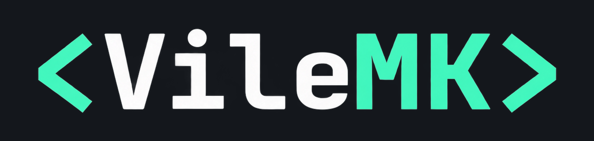
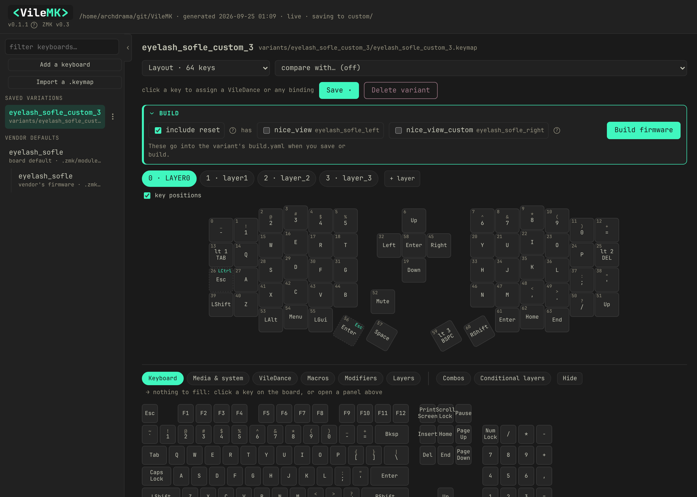
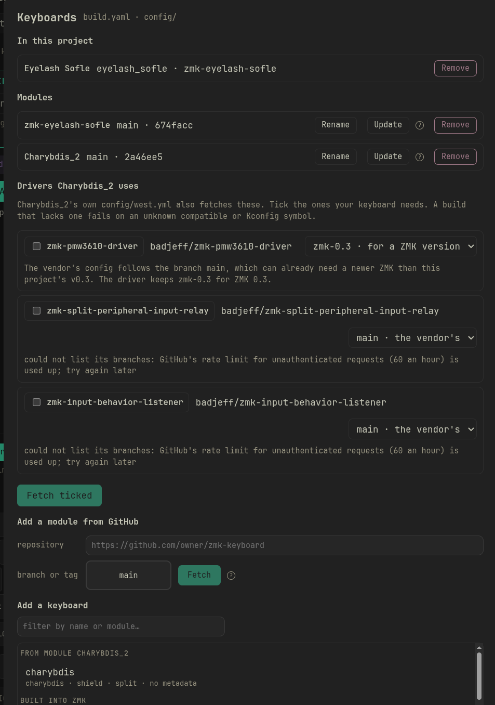
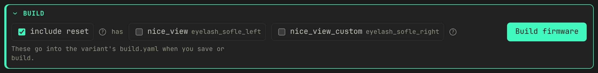
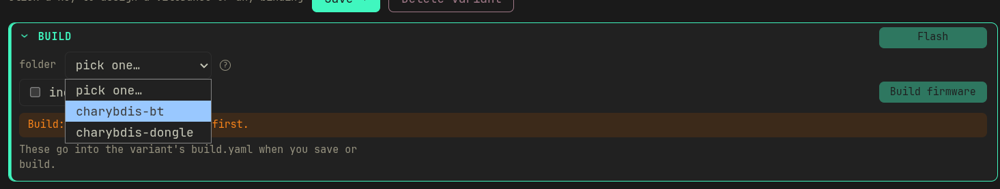
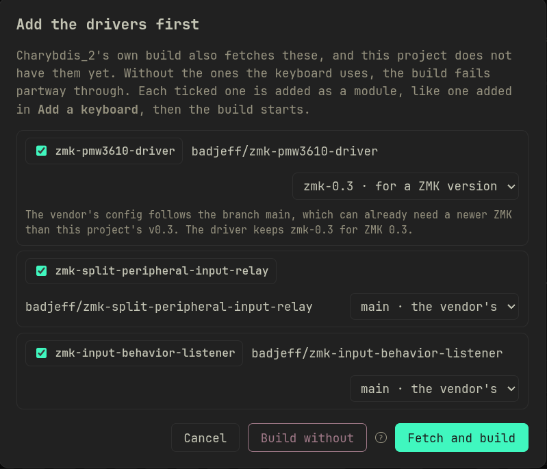
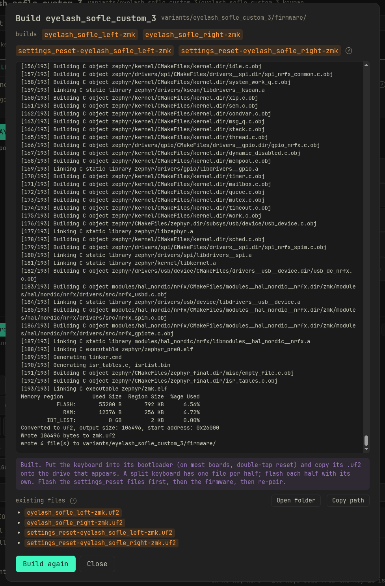

<p align="center">
  
</p>


VileMK builds ZMK firmware for your keyboard on your own machine, from a keymap
you edit in a local web app. The keymap can use the things ZMK Studio can't
express: combos, macros, VileDances (Vial-style tap/hold/double-tap dances),
hold-taps and home-row mods, mod-morphs, conditional layers. The build runs in
ZMK's own build container under Docker and produces the `.uf2` files you
flash.

The name is a nod to [Vial](https://get.vial.today/), the graphical keymap
editor from the QMK world that inspired this project. Vial is a potion bottle;
VileMK is vile, as in ruthless. There is no live USB protocol. You edit the
keymap in the app, it is validated locally, and the firmware is compiled
locally.



## Build your own firmware

From a fresh clone to a flashed keyboard. Each step is covered in more detail
further down.

### 1. Requirements

- **Python 3.9+.** The Python side has no dependencies.
- **Node**, to build the web app. `make design` does it for you.
- **Docker**, for the build itself. Your user has to be able to run `docker`
  without sudo (on Linux, be in the `docker` group). Without Docker the app
  still designs, checks and exports keymaps; the **Build firmware** button is
  off and says why.

### 2. Fetch ZMK

```bash
make zmk
```

That downloads the parts of ZMK the app needs and pins the exact commit, so
every keyboard and every variant is checked and built against the same ZMK. The
**ZMK** link under the logo in the app opens the same thing as a settings
sheet, with an **Update** button.

### 3. Start the app

```bash
make design
```

It builds the web app, then serves it on `http://127.0.0.1:7879`.

### 4. Add your keyboard

**Add a keyboard** in the sidebar lists every keyboard in ZMK and in the
keyboard modules you have installed. If yours comes from a vendor module that
is not installed yet, paste the module's GitHub URL and a branch or tag into
the same dialog; its keyboards then appear in the list. Adding a keyboard puts
its vendor keymap under **Vendor defaults** in the sidebar. For a keyboard that
plugs into a separate controller, you pick the controller.

Some keyboards need more modules than their own, such as a trackball or
encoder driver. When a fetched module's own `config/west.yml` lists modules
this project does not have, the dialog shows them under **Drivers ... uses**,
each with a tick and a branch or tag. They are unticked: at this point VileMK
only knows that the vendor's build fetches them, not which ones your keyboard
uses. You can fetch them here, or leave them for later. The list is gone
once the dialog closes.



Which ones a build needs shows up when you build a variant (step 6).

### 5. Make a variant

Select the vendor default, change what you want on the board, and press
**Save as…**. It asks for a name and adds the keymap to **Saved variations**.
From then on you edit the variant, and its **Save** button offers **Overwrite**
or **Save as…**.

Vendor defaults are never edited. They are the starting point and the thing
**compare with…** compares against.

### 6. Build



The **Build** panel under the Save button holds the build options for the
variant on screen:

- **include reset** also builds a settings reset file for each half. See the
  warning under step 7 for when you need it.
- **has** lists the parts the vendor builds for (screens, add-on modules), per
  half. Tick the ones physically on your keyboard. An unticked screen also
  switches the display off for that half, so the build does not fail looking
  for hardware that is not there.
- **folder** appears when the vendor keeps the keyboard in more than one
  folder, one per way of building it. Charybdis has `charybdis-bt` (the halves
  talk to the computer over Bluetooth) and `charybdis-dongle` (a separate
  dongle does). Pick the one that matches your hardware. Build stays off until
  you do.



**Build firmware** uses those choices even if you haven't saved, and the
variant remembers them. The build log streams into the dialog, and the build
can be cancelled.

If the modules the variant builds from fetch drivers this project does not
have yet, **Build** lists them in **Add the drivers first**, all ticked, before
it starts. **Fetch and build** adds the ticked ones and builds; **Build
without** builds as is, for a driver the keyboard does not use. See
[Drivers and other dependencies](TROUBLESHOOTING.md#drivers-and-other-dependencies).



The first build pulls ZMK's build image (about 3 GB) and fetches ZMK, Zephyr
and the hardware libraries. That takes several minutes. A later build of a
split keyboard takes about 20 seconds.



When it finishes, the dialog lists the files it wrote. **Open folder** opens
the firmware folder in your file manager and **Copy path** copies its location.
Before a build, the same list shows what is already there: files the next
build replaces are in orange, files it will remove are struck out.

The same build from a terminal:

```bash
make firmware ARGS=<variant>
```

### 7. Flash

Put the keyboard into its bootloader (on most boards, double-tap reset and it
mounts as a USB drive) and copy its `.uf2` across. A split keyboard has one
file per half, for example `eyelash_sofle_left-zmk.uf2` and
`eyelash_sofle_right-zmk.uf2`, and each half is flashed with its own. A board
that produces a `.bin` instead has no drive to copy to; flash it with the
board's own tool.

> [!WARNING]
> **If the keyboard has ever been used with ZMK Studio**, flash the settings
> reset first. ZMK Studio saves the keys you change in it to the keyboard's
> settings storage, and on every boot those saved keys override the keymap in
> the firmware, for those positions only. Flashing new firmware does not clear
> them and neither does the reset button. The symptom is a keyboard that runs
> your new keymap except for a few keys that do something else or nothing.
> It happens with any ZMK firmware, however it was built.
>
> Tick **include reset** before building. Flash the two `settings_reset-…`
> files to their halves, then the firmware, then pair Bluetooth again: the
> reset clears the Bluetooth pairings too.

## The keyboard list

The sidebar has two groups.

**Saved variations** are your keymaps. They are the only ones you can
overwrite and build.

**Vendor defaults** are the keymaps that come with a keyboard. They are for
comparing against (**compare with…**) and for starting a new variation.

Some vendors ship two keymaps for one keyboard, so the keyboard is listed
twice, each marked:

- **board default** is the keymap ZMK falls back to when a build names none.
- **vendor's firmware** is the keymap the vendor's released firmware is built
  from. It can differ from the board default. The Eyelash Sofle's has a fourth
  layer, left empty as a spare. It is listed one step in, under the board
  default.

The **⋮** button beside each row has **Export keymap**, **Export as picture**,
and **Delete**. Delete on a variation deletes it and its built firmware. On a
vendor default it removes the keyboard from the project, and the keyboard's
module with it. That is refused while variations use the keyboard, and the
dialog names them; delete those first.

### Keyboard modules

**Add a keyboard** also lists your modules. **Update** fetches the latest
commit of the module's branch or tag and checks your variations against it
before replacing anything. If one would break (a key removed from the layout, a
board renamed), the module is left as it was and the dialog lists what would
break, with **Overwrite** to install it anyway. **Remove** is refused while a
variation still uses one of the module's keyboards. **Rename** changes only the
name the app shows.

A module has to be a clean ZMK module: a `zephyr/module.yml` and the keyboard's
files under `boards/`, laid out as ZMK expects, with no custom CI rearranging
them. Many keyboard repositories on GitHub are personal configs that only build
through their owner's workflow. [TROUBLESHOOTING.md](TROUBLESHOOTING.md) says how
to tell them apart, what each build error means, and how to fork a repository
into shape.

From the command line:

```bash
make module ARGS="add <github-url> --ref main"
```

```bash
make module ARGS=<name>
```

## Designing a keymap: every tab in the app

Under the board is a menu of eight tabs: **Keyboard**, **Media & system**,
**VileDance**, **Macros**, **Modifiers**, **Layers**, **Combos** and
**Conditional layers**.

Click a key on the board to open its editor. Whichever tab you're on, picking
something fills that key. The tabs' **+ New …** buttons open a creation panel
above the menu instead, and the menu then fills whichever field in that panel
you last clicked. Only one thing is ever open at once, a key editor or a panel,
but switching loses nothing you typed: each kind keeps its own unsaved draft,
and the tab you left grows a **Resume …** button until you finish it or start a
fresh one.

Six of the eight tabs fill a field this way. **Combos** and **Conditional
layers** don't, because nothing on the board can point at either one. You
switch those on or off for the keymap you're looking at.

The **key positions** checkbox under the layer tabs numbers every key on the
board. **+ layer** beside the layer tabs adds a layer, up to ZMK's own 32-layer
cap. **Empty layer** asks for a name and starts the layer blank (every key
transparent). **Layer from another keyboard…** copies a layer from one of your
saved variations, on any keyboard: search for the variation, pick the layer,
and **Import**. Nothing is written until you save.

A copied layer is matched to this keyboard by key position number: key 0 goes
on key 0, key 1 on key 1, and so on. Each keyboard numbers its keys by its own
layout, so turn on key positions to see where a key lands. On a keyboard with
more keys the extra keys stay transparent. On one with fewer, the bindings past
its last key are left out, and the dialog lists them before you import. The
VileDances, macros and layer entries the layer uses come along when you save.
Layer keys keep their numbers: `&mo 2` switches to layer 2 of the keymap you
are editing.

Rotary encoders are not editable in the app yet. Saving a variant keeps the
encoder bindings the keymap already had, and `make check` still validates them.
To change one, edit the keymap file by hand.

Each tab and its settings are described in [KEYMAP.md](KEYMAP.md):
[Keyboard](KEYMAP.md#keyboard),
[Media & system](KEYMAP.md#media--system),
[VileDance](KEYMAP.md#viledance-vial-style-tap-dances),
[Macros](KEYMAP.md#macros),
[Modifiers](KEYMAP.md#modifiers),
[Layers](KEYMAP.md#layers) and
[Combos and Conditional layers](KEYMAP.md#combos-and-conditional-layers).

### Saving

Everything you design in the tabs is saved as you work, independent of any
keymap. Nothing reaches a keymap until you save a variant. Only the generated
behaviors your keys, VileDances and combos actually reference are written into
it; anything designed but never bound stays out.

## Sharing a layout

Sharing means sharing the `.keymap`. **Export keymap** in a row's **⋮** menu
works for variations and vendor defaults. It offers **Save as…** (pick where to
write the file) or **Copy to clipboard**, and **include key positions** adds a
comment at the top of the file drawing the layout with each key's position
number. The exported file carries one extra comment line listing the
VileDances, macros, combos and layer entries the keymap uses, which is what
lets VileMK restore them on import. The compiler ignores it.

**Import a .keymap** in the sidebar takes one back, or you can drop the file on
the sidebar. It refuses a keymap for a keyboard you have not added, since
without the physical layout there is nothing to draw, and tells you which
module to add. Where an incoming record has the same name as one of yours but
different contents, it asks: rename the incoming one (every reference in the
keymap is rewritten to match) or keep yours. Your own records are never
overwritten. What it writes is a new variant, and it runs the same checks
`make check` does before handing it back.

**Export as picture**, in the same menu, has **Copy image**, **Save PNG** and
**Save SVG**, for pasting a layout into a chat.

## Building firmware in detail

**Build firmware** compiles every half of the variant, plus the settings reset
files if **include reset** is ticked. The firmware folder is replaced only when
everything built; a failed or cancelled build leaves the previous files. A
variant whose keyboard is not installed (its module was removed, or the keymap
came from someone else) is refused before Docker starts, with a message naming
the missing board.

The build runs in `zmkfirmware/zmk-build-arm:stable`, the image ZMK's own build
workflow uses. The ZMK and Zephyr sources it fetches on the first build are
kept in a Docker volume, `vilemk-zmk`, and reused by later builds. To free the
space:

```bash
docker volume rm vilemk-zmk
```

The next build fetches them again.

### Repositories built by their maker's own CI

Some keyboard repositories only build through their maker's GitHub workflow,
which deletes or copies files first. VileMK recognises the usual steps and
builds from a prepared copy under `.zmk/stage/`, leaving `.zmk/modules/` as
fetched. Where the repository offers more than one way to build, you pick:

- **folder**: shown in the Build panel when the repository keeps the keyboard
  in several folders (for example Bluetooth and dongle). Build stays off until
  one is picked.
- **builds**: the maker's own build entries, to tick. Build stays off when
  none is ticked, or when one half is ticked twice.
- **vendor settings**: in the build sheet, the maker's `config/*.conf` files,
  ticked the way the maker's build applies them.

The drivers such a repository pulls in are listed after fetching it, in the
keyboards sheet, and again by **Build** for any still missing (see step 4). [TROUBLESHOOTING.md](TROUBLESHOOTING.md#repositories-vilemk-prepares)
has the details and a Charybdis example.

### Parts the vendor lists

Most keyboards are more than a board. A screen, an encoder or an add-on module
is a separate part the build has to be told about, on the half it is plugged
into. The vendor writes one build list for every version they sell, with a
screen and without, so it cannot say which one is on your desk. That is what
the Build panel's **has** boxes are for.

An unticked screen switches the display off for that half, because a vendor
building for the version with a screen often turns the display on for
everyone, and the build then fails looking for hardware that is not there. To
switch a feature off for a half yourself, put the setting in that half's
`.conf` file in `config/`, named after the board (for an Eyelash Sofle's left
half, `config/eyelash_sofle_left.conf`):

```
CONFIG_ZMK_DISPLAY=n
```

It is added on top of the vendor's settings, and nothing VileMK fetches ever
overwrites it.

`make check` compares a variant's build against the vendor's list and prints
what is missing, such as a part the vendor builds that your variant leaves out
with nothing switching the matching feature off. It never changes anything. It
cannot catch a part the vendor never listed, or a keyboard with no vendor
module at all, and says so when it has nothing to compare against.

### A worked example: Eyelash Sofle

The Eyelash Sofle comes from the `zmk-eyelash-sofle` module, and after adding
it the sidebar shows its keymaps under **Vendor defaults**. In the app you
design some VileDances and combos, bind them, and **Save as…**
`eyelash_sofle_colemak`.

The vendor lists `nice_view` on the left half and `nice_view_custom` on the
right, so the Build panel shows both under **has**. This keyboard has no
screens, so both stay unticked, and the left half gets its display switched
off.

**Build firmware** then writes `eyelash_sofle_left-zmk.uf2` and
`eyelash_sofle_right-zmk.uf2`. Flash the left half with the left file and the
right half with the right one. If the keyboard has been used with ZMK Studio,
read the warning under [step 7](#7-flash) first.

## make

```
make          # check every keymap, then build the app and serve it
make design   # build the app, then serve it
make check    # validate every keymap and build list
make pos      # print each keyboard's key-position map
make zmk      # fetch ZMK and pin the commit
make module ARGS=<name>        # fetch or update a keyboard module
make firmware ARGS=<variant>   # build a variant's firmware (needs Docker)
make install  # put the vilemk-* commands on your PATH
```

If the page ever says the app is not built yet, run `make web`.

`make` only looks for a Makefile in the current directory. From anywhere else,
point it at the checkout:

```bash
make -C path/to/VileMK
```

Or run `make install` once and use the `vilemk-*` commands (`vilemk-design`,
`vilemk-check`, `vilemk-build` and the rest) from any directory.
