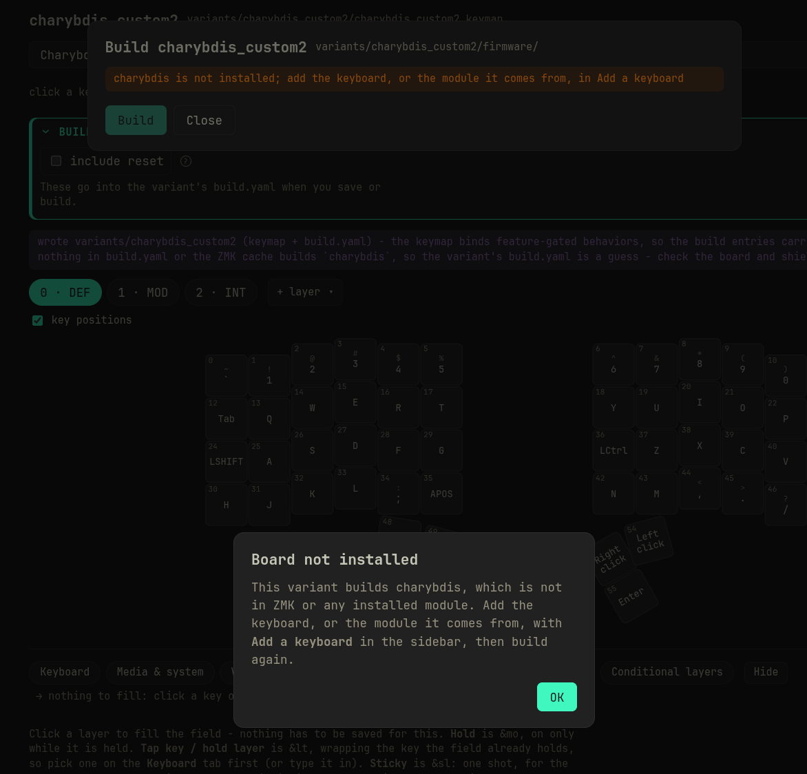
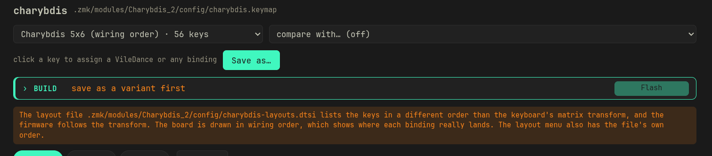
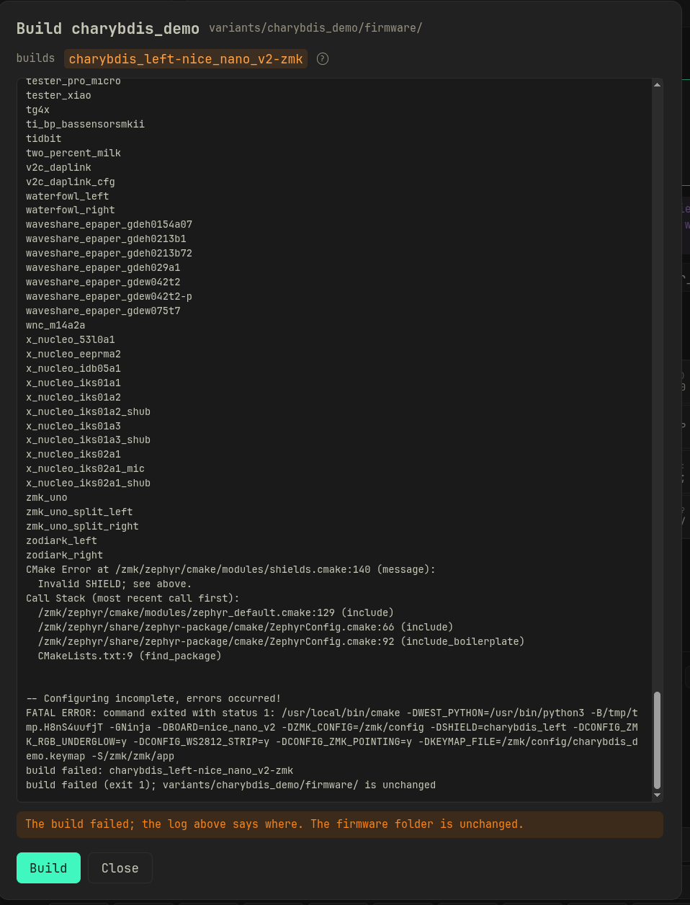

# Troubleshooting keyboard modules

[← back to the README](README.md#keyboard-modules)

VileMK builds a keyboard from a module the same way ZMK does: west fetches the
module from GitHub and Zephyr looks for the keyboard's files in the places a
module declares. Many keyboard repositories on GitHub are someone's personal
config, built by their own CI, which moves or deletes files before each build.
VileMK does not run that CI. It recognises the common steps and builds from a
prepared copy of the repository instead, asking you where the repository offers
more than one way to build. What it cannot repeat is listed below.

- [What a module needs](#what-a-module-needs)
- [Repositories VileMK prepares](#repositories-vilemk-prepares)
- [Errors and what they mean](#errors-and-what-they-mean)
- [Drivers and other dependencies](#drivers-and-other-dependencies)
- [Example: Charybdis](#example-charybdis)

## What a module needs

A module that works in ZMK's own build, and in VileMK without any preparing,
looks like this:

```
zephyr/module.yml                       declares board_root: .
boards/shields/<keyboard>/
    <keyboard>.zmk.yml                  name, type, split halves
    <keyboard>.keymap                   the default keymap
    <keyboard>_left.overlay             one .overlay per shield name
    <keyboard>_right.overlay
    Kconfig.shield
    Kconfig.defconfig
    <keyboard>.dtsi                     anything the overlays include
build.yaml                              optional, one entry per half
```

A keyboard that is its own board (not a shield on a controller) keeps the same
files under `boards/arm/<keyboard>/` instead, with a `<board>.yaml` beside them.

What each part is for:

- **`zephyr/module.yml`** is what makes Zephyr read the repository at all.
  It holds:

  ```yaml
  build:
    settings:
      board_root: .
  ```

- **`<keyboard>.zmk.yml`** gives the keyboard its name, its halves and the
  controllers it fits. Without it the keyboard is still in **Add a keyboard**,
  named after its shields and marked "no metadata", and every controller is
  offered.
- **One folder per shield name.** Zephyr finds a shield by its `.overlay`
  file, and two folders with `charybdis_left.overlay` make the build fail.
- **Every file an overlay includes is in that folder.**

## Repositories VileMK prepares

When a module breaks one of those rules in a way VileMK recognises, the build
uses a copy of it under `.zmk/stage/` with the problem fixed. The fetched
module in `.zmk/modules/` is never changed. VileMK prepares a repository that:

- **Has no `zephyr/` folder, or keeps its shields under
  `config/boards/shields/`.** The copy gets a `zephyr/module.yml` pointing at
  wherever the shields are.
- **Defines the same shields in more than one folder**, one per way of
  building (for example `charybdis-bt/` and `charybdis-dongle/`), with a
  workflow that deletes the others. The Build panel shows a **folder** select,
  and the copy keeps only the folder you pick. Build stays off until you pick
  one.
- **Has overlays that include a file from its `config/`** (a workflow `cp` or
  `mv` step). The copy has the file in the shield folder.
- **Keeps settings in `config/*.conf`**, such as `charybdis_right.conf`
  turning the trackball on. The build sheet lists them under **vendor
  settings**, ticked the way the vendor's own build applies them, and the
  ticked ones are added to the shields' settings in the copy.

For a prepared keyboard the Build panel also lists the vendor's own build
entries under **builds**. Tick the ones to build. A vendor often lists a half
twice, for example with and without ZMK Studio; Build stays off until only one
of them is ticked.

What VileMK does not repeat:

- Edits a workflow makes to the keymap (`sed` on bindings). The variant's
  keymap is yours; change it in the app.
- A ZMK fork or feature branch the repository's `config/west.yml` pins. VileMK
  builds with the ZMK in the settings. A keyboard that needs a fork's features
  may fail to build.
- Anything else a workflow runs. If a repository still fails after preparing,
  look for the keyboard maker's own module, often named `zmk-<keyboard>` or
  `zmk-keyboard-<keyboard>`, or fork the repository into the layout above.

## Errors and what they mean

### "it has no keyboard VileMK can add"

The message after fetching a module. The module was fetched, but it has no
shield folder under `boards/shields/` (or `config/boards/shields/`), and no
board with a `*.zmk.yml` and a default `.keymap`. Driver modules, such as a
trackball driver, look like this and are fine to keep: the build uses them.

### "Build entries from the vendor's own firmware"

A dialog after saving a variation, for a keyboard that is not prepared. The
vendor's `build.yaml` names every entry after one of its own firmware files.
VileMK took one entry per board and shield from it. Check the boards and
shields in the variation's `build.yaml`.

### "... is not installed"

No installed module has a board or shield by that name. Either the module is
missing, or the variation's `build.yaml` names the keyboard wrongly. If it
says `board: <keyboard>` under a comment saying the entry is a guess, VileMK
found no build entry for the keyboard: edit the board and shield names by
hand.



### "... lists its keys in a different order than its wiring"

A warning under the layout menu, with the menu outlined. The keyboard's
physical layout file (the picture VileMK and ZMK Studio draw) lists its keys
in a different order than its matrix transform (the wiring). The firmware
follows the wiring: binding 30 goes to the switch at position 30 of the
transform, wherever the picture draws it. Charybdis_2 does this. Its layout
file lists the left half of the bottom two rows before the right half, so
drawn from the file, Z X C V B appear on the right half.

VileMK draws the board in **wiring order** by default, so each binding shows
on the key that types it. The layout menu also has the file's own order. A
variation made while the board was drawn from the file has its keys where
that picture showed them, so on the keyboard they type from other keys.
Rearrange them against the wiring-order board and save again. Nothing in the
module is changed. ZMK Studio still draws the file's order.



### "Pick the shield folder"

The module keeps this keyboard in more than one folder and the variation has
none picked. Pick one in the Build panel's **folder** select.

### "Zephyr would find a shield twice"

Two installed modules define the same shield, for example two Charybdis
repositories. Remove all but one of them in Add a keyboard. (Two folders in
one module are the **folder** select above, not this error.)

### `Invalid SHIELD` in the build log

Zephyr did not find the shield. VileMK prepares repositories without
`zephyr/module.yml` or with shields under `config/boards/shields/`, so this
now means the shield is somewhere else again: under a folder name ZMK does not
search, or named differently from its `.overlay` file. Check the repository's
layout against the one above.



### `No such file or directory` on an `#include` in the build log

An overlay or `.dtsi` includes a file that is neither in its folder nor in
the repository's `config/`, usually one the vendor's CI downloads or
generates. Move the file into the shield folder in a fork.

### Unknown `compatible` or undefined Kconfig symbol in the build log

The keyboard needs a driver that is not installed, or one at a branch written
for another ZMK version. See the next section.

## Drivers and other dependencies

A keyboard with a trackball, trackpad, encoder driver or display often needs
extra modules. A config repository lists them in its `config/west.yml`. After
fetching a module, the keyboards sheet lists the ones this project does not
have yet under **Drivers ... uses**, each with a tick and a branch or tag.
None is ticked: tick the ones your keyboard needs and **Fetch ticked**.

For a repository VileMK prepares (one that only builds through its maker's
CI), **Build** also checks: if any of its drivers are missing, it lists them
in **Add the drivers first**, all ticked, before the build starts. **Fetch and
build** adds the ticked ones and builds. **Build without** builds as is, for
a driver your keyboard does not use.

The branch matters. A driver's `main` often follows ZMK's development branch,
which a project on the ZMK release cannot build against. Many drivers keep a
branch per ZMK version (`zmk-0.3`, `zmk-0.4`); when the vendor's config names a
branch and the driver has one for this project's ZMK, that one is preselected,
with a line saying why. A tag or commit the vendor pins is kept as it is.

A trackball keyboard that uses a PMW3610 sensor, for example, needs
`badjeff/zmk-pmw3610-driver` or another PMW3610 driver. Build log lines naming
`pixart,pmw3610` or `CONFIG_PMW3610` point to it.

## Example: Charybdis

Two Charybdis repositories show what preparing covers.

`tetsu-wang/Charybdis_2` has `zephyr/module.yml`, but its workflow builds it
in steps VileMK repeats:

- `boards/shields/charybdis-bt/` and `boards/shields/charybdis-dongle/` both
  define `charybdis_left` and `charybdis_right`. The workflow deletes one.
- `charybdis.dtsi` includes `charybdis-layouts.dtsi`, which is in `config/`.
- The trackball is switched on in `config/charybdis_right.conf`.
- Its `config/west.yml` pulls three badjeff modules: the PMW3610 driver, a
  split peripheral input relay and an input behavior listener.

To use it:

1. In **Add a keyboard**, fetch `https://github.com/tetsu-wang/Charybdis_2`,
   branch `main`.
2. Under **Drivers Charybdis_2 uses**, tick the three badjeff modules. The
   PMW3610 driver comes preselected at `zmk-0.3`, since its `main` is written
   for a newer ZMK. **Fetch ticked**.
3. Add **charybdis** (marked "no metadata") on `nice_nano_v2`.
4. Save a variation from its keymap under **Vendor defaults**.
5. In the Build panel, pick `charybdis-bt` or `charybdis-dongle` as the
   folder, and tick one entry per half (and the dongle, for the dongle
   folder).
6. Build. The build sheet shows the vendor settings files; leave them ticked.
   If you skipped step 2, Build lists the badjeff modules first and fetches
   them before building.

`Vzhao-L/zmk-for-charybdis` has no `zephyr/` folder and keeps its shields in
`config/boards/shields/charybdis/`. Fetch it, tick its PMW3610 driver if you
want the trackball, add **Charybdis**, and build. There is no folder to pick.
Only one of the two repositories can be installed at a time, since both define
`charybdis_left`.
