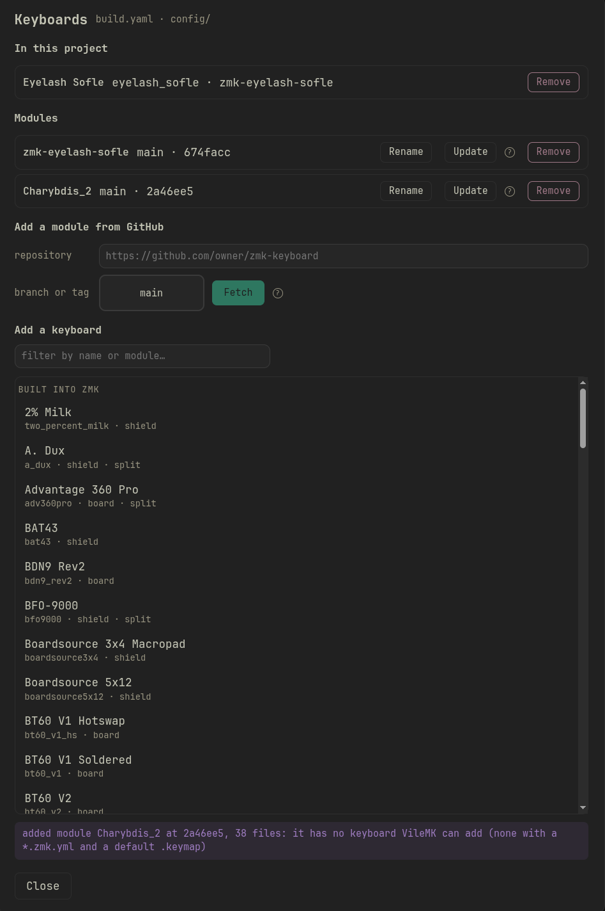
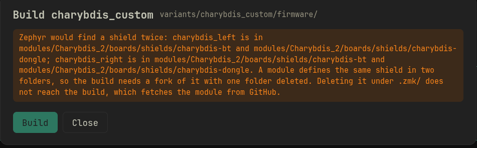

# Troubleshooting keyboard modules

[← back to the README](README.md#keyboard-modules)

VileMK builds a keyboard from a module the same way ZMK does: west fetches the
module from GitHub and Zephyr looks for the keyboard's files in the places a
module declares. A module works only when its files are already where ZMK
expects them. Many keyboard repositories on GitHub are someone's personal
config, built by their own CI, which moves or deletes files before each build.
VileMK does not run that CI, so those repositories fail here.

- [What a module needs](#what-a-module-needs)
- [Telling a module from a customised config repo](#telling-a-module-from-a-customised-config-repo)
- [Errors and what they mean](#errors-and-what-they-mean)
- [Drivers and other dependencies](#drivers-and-other-dependencies)
- [Example: Charybdis](#example-charybdis)

## What a module needs

Before fetching a repository, open it on GitHub and check its layout. A module
that VileMK can add and build looks like this:

```
zephyr/module.yml                       declares board_root: .
boards/shields/<keyboard>/
    <keyboard>.zmk.yml                  name, type, split halves
    <keyboard>.keymap                   the default keymap
    <keyboard>_left.overlay             one .overlay per shield name
    <keyboard>_right.overlay
    Kconfig.shield
    Kconfig.defconfig
    <keyboard>.dtsi                     anything the overlays include
build.yaml                              optional, one entry per half
```

A keyboard that is its own board (not a shield on a controller) keeps the same
files under `boards/arm/<keyboard>/` instead, with a `<board>.yaml` beside them.

What each part is for:

- **`zephyr/module.yml`** is what makes Zephyr read the repository at all.
  Without it, west downloads the repository and the build never looks inside.
  It holds:

  ```yaml
  build:
    settings:
      board_root: .
  ```

- **`<keyboard>.zmk.yml`** and **`<keyboard>.keymap` in the same folder** are
  what put the keyboard in **Add a keyboard**. Without them the module is
  added, and its keymap may still show under **Vendor defaults**, but the
  keyboard is not in the list.
- **One folder per shield name.** Zephyr finds a shield by its `.overlay`
  file. If two folders both have `charybdis_left.overlay`, the build cannot
  use either.
- **Every file an overlay includes is in the repository, in that folder.**
  Nothing may depend on a CI step copying it in.

## Telling a module from a customised config repo

A repository is probably a personal config, and will not build here, when it
has any of these:

- No `zephyr/` folder at the root.
- The shields under `config/boards/shields/` instead of `boards/shields/`.
- Its own `config/west.yml` pinning ZMK to a fork or a feature branch.
- Two folders that define the same shield, for variants like Bluetooth and
  dongle, with a workflow in `.github/workflows/` that deletes one.
- A workflow that copies, renames or edits files (`cp`, `mv`, `rm`, `sed`)
  before calling the build.
- `build.yaml` entries with keys ZMK does not use, such as `keymap:` or
  `format:`, and an `artifact-name:` on every entry.

Look for the keyboard maker's own module instead. Names like
`zmk-<keyboard>` or `zmk-keyboard-<keyboard>` are common. A keyboard that ZMK
already ships needs no module: it is under **Built into ZMK** in Add a
keyboard.

If the only repository available is a customised one, fork it on GitHub, make
the fork look like the layout above, and fetch the fork.

## Errors and what they mean

### "it has no keyboard VileMK can add"

The message after fetching a module. The module was fetched, but no shield
folder has both a `*.zmk.yml` and a default `.keymap`. Check
**Vendor defaults** in the sidebar: if the repository has a keymap anywhere,
it is listed there and you can save a variation from it. Whether that
variation builds depends on the rest of this page.



### "Build entries from the vendor's own firmware"

A dialog after saving a variation. The vendor's `build.yaml` names every
entry after one of its own firmware files. VileMK took one entry per board and shield from it. Check the boards
and shields in the variation's `build.yaml`. This is a warning, not an error,
but it often means the repository is built by a custom CI.

### "... is not installed"

No installed module has a board or shield by that name. Either the module is
missing, or the variation's `build.yaml` names the keyboard wrongly. If it
says `board: <keyboard>` under a comment saying the entry is a guess, VileMK
found no build entry for the keyboard: edit the board and shield names by
hand.


### "Zephyr would find a shield twice"

Two folders define the same shield. If they are in two modules, remove one of
the modules in Add a keyboard. If both are in one module, fork it and delete
the folder you do not use. Deleting the folder under `.zmk/modules/` does not
help: the build downloads the module from GitHub again.



### `Invalid SHIELD` in the build log

Zephyr did not find the shield. Usually the repository has no
`zephyr/module.yml`, or keeps its shields under `config/boards/shields/`.
VileMK cannot catch this before the build yet. Use a module with the layout
above, or a fork that has it.


### `No such file or directory` on an `#include` in the build log

An overlay or `.dtsi` includes a file that is not in the repository at that
path, usually one the vendor's CI copies in. Move the file into the shield
folder in a fork.

### Unknown `compatible` or undefined Kconfig symbol in the build log

The keyboard needs a driver that is not installed. See the next section.

## Drivers and other dependencies

A keyboard with a trackball, trackpad, encoder driver or display often needs
extra modules. A config repository lists them in its `config/west.yml`, which
VileMK does not read. Open that file on GitHub and fetch each project it lists
(other than `zmk`) as a module in Add a keyboard.

A trackball keyboard that uses a PMW3610 sensor, for example, needs
`https://github.com/badjeff/zmk-pmw3610-driver` or another PMW3610 driver.
Build log lines naming `pixart,pmw3610` or `CONFIG_PMW3610` point to it.

## Example: Charybdis

Two Charybdis repositories show the two common problems.

`Vzhao-L/zmk-for-charybdis` is a personal config. It has no `zephyr/` folder
and keeps its shields in `config/boards/shields/charybdis/`. It fetches, and
the build fails with `Invalid SHIELD`.

`tetsu-wang/Charybdis_2` has `zephyr/module.yml`, but its GitHub workflow
builds it in a way VileMK cannot repeat:

- `boards/shields/charybdis-bt/` and `boards/shields/charybdis-dongle/` both
  define `charybdis_left` and `charybdis_right`. The workflow deletes one
  before each build.
- `charybdis.dtsi` includes `charybdis-layouts.dtsi`, which is in `config/`.
  The workflow moves it into the shield folder.
- The shield folders have no `charybdis.zmk.yml`, so the keyboard is not in
  Add a keyboard. Its keymap, `config/charybdis.keymap`, is under Vendor
  defaults.
- The right half uses a PMW3610 trackball. Its `config/west.yml` pulls
  `badjeff/zmk-pmw3610-driver`, `badjeff/zmk-split-peripheral-input-relay` and
  `badjeff/zmk-input-behavior-listener`.

To use it anyway:

1. Fork `tetsu-wang/Charybdis_2` on GitHub.
2. In the fork, delete `boards/shields/charybdis-dongle/` (or `charybdis-bt/`
   if you use the dongle).
3. Move `config/charybdis-layouts.dtsi` into the shield folder you kept.
4. In Add a keyboard, remove `Charybdis_2` and fetch your fork.
5. Fetch `https://github.com/badjeff/zmk-pmw3610-driver`, branch `main`.
6. Build. If the right half fails on something mentioning an input relay or
   input listener, fetch the other two badjeff modules and build again.
